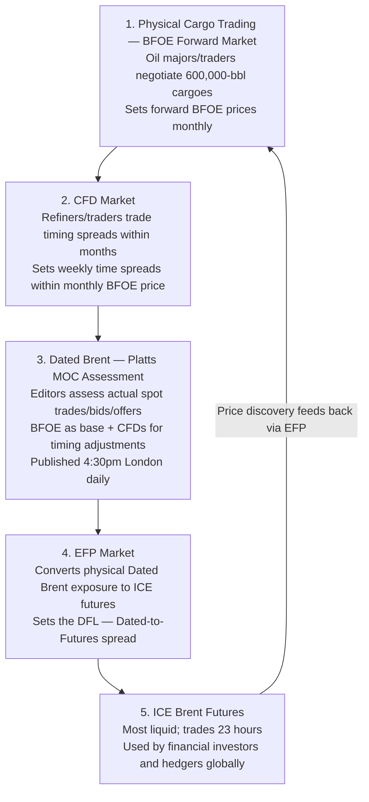

The **Brent complex** is the world's dominant crude oil pricing benchmark, influencing ~70% of globally traded crude. It is not a single price but an interlocking system of physical cargoes, forward contracts, derivatives, and futures — each serving a different purpose.

---

## Why Brent, Not Just "Oil Price"

```
  Global crude pricing benchmarks:
  ─────────────────────────────────────────────────────────
  Brent Blend:    North Sea crude; basis for Atlantic Basin,
                  European, and most global trades
  WTI:            West Texas Intermediate; US domestic crude;
                  basis for NYMEX futures (Cushing delivery)
  Dubai/Oman:     Middle East sour crude; Asian pricing
  ─────────────────────────────────────────────────────────

  Brent's dominance: ~70% of global crude trades vs. Brent
  WTI: Used for US pricing; increasingly exported post-2015
  Dubai: Asian grades differential against Brent

  Why NOT just WTI globally?
  → WTI is landlocked (Cushing, Oklahoma)
  → Infrastructure constraints distort WTI vs. global supply/demand
  → 2020: WTI went NEGATIVE (−$37.63) due to storage limit at Cushing
  → Brent is a maritime, freely-trading benchmark
```

---

## The BFOE Layer: Physical Crude

### What is BFOE?

**BFOE** refers to the basket of four North Sea crude streams that underpin the Dated Brent benchmark:

```
  B — Brent (UK North Sea; Sullom Voe terminal)
  F — Forties (UK North Sea; dominant stream; Hound Point terminal)
  O — Oseberg (Norwegian North Sea; Sture terminal)
  E — Ekofisk (Norwegian; Teesside terminal)

  Quality hierarchy:
  Forties:  Higher sulfur vs. Brent (deliverable at discount)
  Oseberg:  Premium quality; sweeter, lighter
  Ekofisk:  Similar to Oseberg
  Brent:    Original stream; now much reduced volume

  Why BFOE (not just Brent)?
  → Original Brent field production declined
  → If only Brent stream: market could become illiquid and manipulable
  → Adding Forties/Oseberg/Ekofisk ensures sufficient physical volume
  → Each cargo loaded = 600,000 barrels

  Later additions:
  T — Troll (Norwegian): added 2023 → now "BFOET"
  (Additional streams added as BFOE volumes declined further)
```

### Dated Brent

**Dated Brent** is the spot price for physical crude cargoes with a specific loading date:

```
  "Dated" = the cargo has been DATED (loading dates assigned)

  Timeline of a North Sea crude trade:
  Day 1:  Seller nominates cargo with 3-7 days forward loading window
          → Cargo is now "dated"
  Day 1–7: Seller and buyer negotiate; Dated Brent price established
  Day 7–14: Loading occurs at terminal
  Days later: Tanker delivers to refinery

  Dated Brent = benchmark for physical spot cargoes loading
                within the next 10–25 days

  Published by: Platts (now S&P Global Commodity Insights)
                → Assessed via the BWAVE/MOC (Market on Close) process
                → Reflects actual bids, offers, and deals in a 30-min window

  Platts assessment:
  → 16:00–16:30 London time (MOC window)
  → Participants submit bids/offers/trades for BFOE cargoes
  → Platts editors assess a "fair value" based on activity
  → Published as Dated Brent
```

---

## The Forward Market: 21-Day BFOE

Before cargo loading dates are fixed, crude trades as **forward BFOE** contracts (also called "cash BFOE" or "25-day BFOE"):

```
  FORWARD BFOE (Cash BFOE):
  → Commitment to deliver/receive one BFOE cargo
  → Delivery: any 3-day window within a nominated month
  → Seller has the right to nominate which stream (B, F, O, or E)
    → Seller delivers "cheapest-to-deliver" → usually Forties
  → Size: 600,000 barrels (standard North Sea cargo)

  The forward BFOE market runs approximately:
  → 2–3 months forward (current + 2 months)
  → Trades OTC between oil majors, trading houses, banks

  Key participants:
  Vitol, Trafigura, Gunvor, Glencore (trading houses)
  BP, Shell, TotalEnergies (integrated majors)
  Mercuria, Freepoint (specialists)

  Price discovery: Forward BFOE > Dated Brent when market
  is in contango; Forward < Dated when backwardated.
```

---

## CFDs: Contracts for Difference

**CFDs** (in crude oil, not equity CFDs) are the key instrument linking Dated Brent to forward BFOE:

```
  CRUDE OIL CFD = Differential between Dated Brent and
                  Cash BFOE for the same period

  CFD = Dated Brent − Forward BFOE (for a given week)

  Why do CFDs exist?
  → Dated Brent is a rolling weekly assessment
  → Forward BFOE is a monthly instrument
  → CFDs price the "timing risk" within a month

  Example:
  Forward BFOE (June) = $80.00/bbl
  Dated Brent (third week June, assessed) = $80.50/bbl
  CFD (third week June) = +$0.50/bbl

  Users of CFDs:
  → Refiners hedging physical purchase timing risk
  → Traders managing the spread between when they buy/sell physicals
    and when they hedge with futures
  → "Window traders" who trade the MOC window risk
```

---

## DFLs: Dated to Frontline Swaps

```
  DFL = Dated Brent vs. ICE Brent Front-Month Futures

  DFL = Dated Brent − ICE Brent Futures (nearest contract)

  This spread reflects:
  → The quality/location premium of physical Dated vs. futures
  → Temporary supply/demand imbalances
  → The convergence mechanism between physical and paper

  DFLs are used by:
  → Producers: converting physical sales (Dated Brent) to
    futures-based hedges
  → Refiners: locking in the physical-to-futures relationship
  → Traders: exploiting mispricings between physical and paper markets
```

---

## ICE Brent Futures

**ICE Brent Crude Oil Futures** (contract code: B) are the primary paper trading vehicle for Brent-linked crude exposure:

```
  ICE Brent Futures specifications:
  ─────────────────────────────────────────────────────────
  Exchange:       ICE Futures Europe (London)
  Ticker:         B (front month), BZ (combined)
  Contract size:  1,000 barrels
  Delivery:       Cash-settled (vs. NYMEX WTI which is physical)
  Settlement:     Against ICE Brent Index
  Months:         Up to 12 years forward; most liquid 1–6 months
  Trading hours:  23-hour electronic; ICE platform
  Daily OI:       ~300,000–400,000 contracts (~$30bn notional)
  ─────────────────────────────────────────────────────────

  Key difference from WTI:
  NYMEX WTI:  PHYSICALLY settled (must deliver/accept at Cushing)
  ICE Brent:  CASH settled against ICE Brent Index
  → No physical delivery squeeze risk for Brent futures
  → ICE Brent Index = weighted average of EFP and Dated Brent
```

### The EFP: Exchange for Physical

The **EFP (Exchange for Physical)** is the critical mechanism linking ICE futures to the physical forward BFOE market:

```
  EFP = simultaneous exchange of:
  1. ICE Brent futures position (buy/sell a number of contracts)
  2. Equivalent physical forward BFOE position (sell/buy a cargo)

  EFP price = difference between the futures price and the
              forward BFOE price for the same period

  Why EFPs matter:
  → Allow physical players to convert their physical exposure
    to futures exposure (or vice versa)
  → Connect the physical (BFOE) market to the financial (ICE) market
  → EFP market is where the "cost of switching" between the two
    markets is priced

  Who uses EFPs:
  → Producers: lock in physical sale, convert to futures hedge
  → Refiners: convert futures hedge back to physical purchase
  → Trading houses: arbitrage physical vs. paper markets
  → ICE settlement: the ICE Brent futures settle via EFP process

  EFP is typically NEGATIVE when Brent futures are at a premium
  to physical (contango), and POSITIVE in backwardation.
```

---

## The Full Price Discovery Chain



Each layer provides different information: Futures carry global risk appetite and macro sentiment; BFOE/Dated reflect physical supply/demand and actual scarcity; CFD/EFP price timing and quality spreads for operational hedging.

---

## Brent-WTI Spread

```
  EFS (Exchange of Futures for Swaps) spread / Brent-WTI differential:

  Brent − WTI = reflects:
  → Quality differences (Brent: 0.37% sulfur; WTI: 0.24% — WTI is sweeter)
    → In theory, WTI should price at PREMIUM (higher quality)
  → Location/logistics (Cushing landlocked vs. maritime Brent)
  → US vs. global supply/demand imbalance

  Historical norms vs. modern structure:
  Pre-2011: Brent ≈ WTI (or WTI at small premium)
  2011–2015: Brent at $15–20 premium
    → US shale boom → Cushing glut → WTI discount
    → Export ban on US crude prevented arbitrage
  Post-2016: Spread narrows as US export infrastructure expands
  2020–2024: Brent typically $2–5/bbl above WTI

  Arbitrage mechanism:
  When Brent > WTI + shipping cost:
  → Buy WTI, load VLCC (Very Large Crude Carrier), sell as Brent-linked
  → VLCC economics: ~$2–3/bbl to US Gulf to Europe/Asia
  → This shipping arbitrage closes the spread

  2020 Negative WTI:
  → Brent remained positive; WTI went −$37.63
  → Cushing storage full: cost of holding physical WTI >
    any price someone would pay
  → Brent was NOT affected: maritime/seaborne, no storage bottleneck
```

---

## Further Reading

- S&P Global Commodity Insights: *Dated Brent Methodology* — platts.com
- ICE: *Brent Crude Futures Contract Specifications* — theice.com
- *The World for Sale* — Javier Blas & Jack Farchy (Random House, 2021) — trading house mechanics
- *The Oil Factor* — Stephen Leeb (Warner Business Books, 2004)
- Reuters: *The Brent Benchmark* explainer series
- Platts: *Window on the Market* — BFOE methodology documentation
