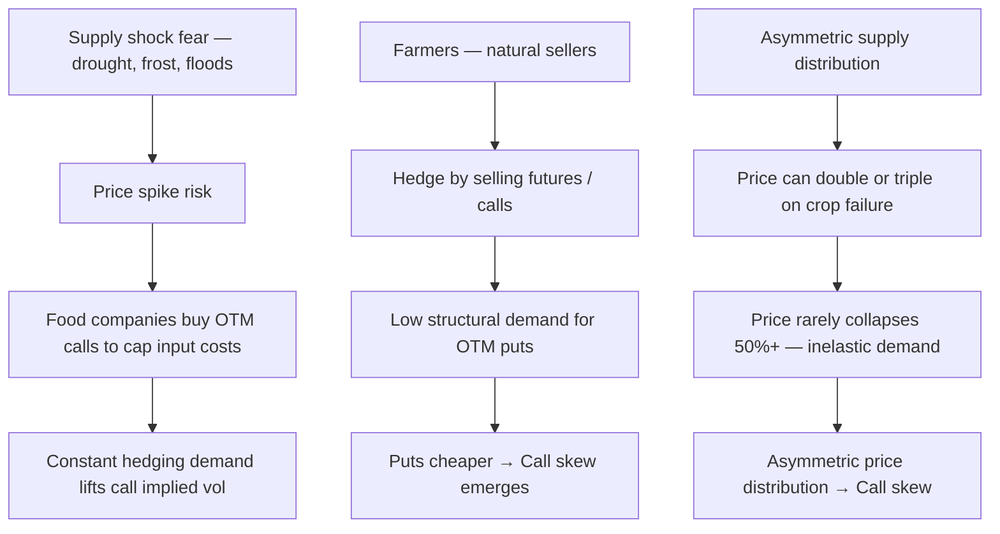
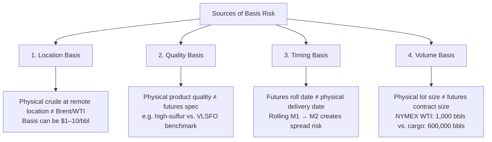

Commodity options markets have fundamentally different volatility dynamics from FX or equity options. Understanding **why commodity vol surfaces are shaped differently** — and what drives the distinctive skew patterns — is essential for pricing and risk-managing commodity derivatives.

---

## How Commodity Vol Differs from FX and Equities

```
  EQUITY VOL (SPX, single stocks):
  → PUT SKEW dominant: investors buy puts for portfolio protection
  → Implied vol inversely correlated to price (VIX rises when S&P falls)
  → Skew driven by: left-tail fear, margin call dynamics, crash risk

  FX VOL (EURUSD, USDJPY etc.):
  → Relatively SYMMETRIC skew (25D risk reversal near zero for major pairs)
  → Skew direction changes by pair and regime
  → Primarily driven by carry and macro positioning

  COMMODITY VOL — KEY DIFFERENCES:
  → Each commodity has its OWN skew direction driven by supply/demand
  → Both CALL skew (agricultural) and PUT skew (energy puts) coexist
  → Physical constraints create asymmetric supply shocks
  → Seasonal effects are much stronger
  → Basis risk between futures and physical is a major hedging issue
```

---

## Agricultural Options: The Call Skew

### Why Agriculture Has Call Skew

Agricultural commodities — corn, soybeans, wheat, coffee, cocoa — typically exhibit **positive (call) skew**: out-of-the-money calls are more expensive than equivalent puts.



### Agricultural Skew by Commodity

```
  CORN (CBOT, ZC):
  → Call skew typically positive (OTM calls rich vs. puts)
  → Skew peaks: May–June (US planting season; weather risk)
  → Old-crop vs. new-crop: different vol term structure
  → Major driver: La Niña / El Niño weather patterns

  WHEAT (CBOT soft, KCBT hard, MGEX spring):
  → Strong call skew; more geopolitical risk than corn
  → 2022 Russia-Ukraine: March 2022 CBOT wheat up 70% in days
  → Call volatility spiked from ~30% to 80%+ implied vol
  → Skew: calls traded at 5–15 vol points above puts

  SOYBEANS (CBOT, ZS):
  → Similar to corn; but South American production (Brazil, Argentina)
    adds July–October weather risk (southern hemisphere summer)
  → Call skew driven by: US summer drought + Brazil summer (Dec-Feb)

  SOFTS (Coffee, Cocoa, Sugar):
  → Coffee (NYBOT): EXTREME call skew
    → Frost risk in Brazil (coffee belt): rare but devastating
    → 1994 Brazil frost: coffee +300% in weeks
    → 2021 Brazil frost: Arabic coffee +100%
    → Market permanently prices this tail risk in OTM calls
  → Cocoa (ICENY): call skew from West Africa (Ivory Coast/Ghana)
    → Crop disease, political instability
```

---

## Energy Options: Put Skew vs. Call Skew

Energy markets show **more complex skew** depending on the specific commodity:

### Crude Oil: Mixed Skew, Regime-Dependent

```
  CRUDE OIL (WTI/BRENT):
  → In CONTANGO/bearish regimes: PUT SKEW (like equities)
  → In BACKWARDATION/supply crisis: CALL SKEW inverts

  Why crude can show call skew:
  → Supply disruptions (war, embargo, OPEC cut): price spike risk
  → 1973 oil embargo: WTI equivalent +400%
  → 2022 Russia-Ukraine: Brent from $75 → $139 in weeks
  → Refiners NEED crude → buy calls to protect against spike

  Why crude shows put skew in normal conditions:
  → Producers (oil companies) hedge output by buying puts
  → "Floor" protection is the primary hedging demand for E&P companies
  → Structural put buying by producers suppresses put prices less
    and lifts put implied vol

  Net result: crude OTM calls and OTM puts both have elevated vol
  → "Volatility smile" rather than pure skew (both wings elevated)
  → Risk reversal can flip sign depending on market regime
```

### Natural Gas: Extreme Seasonality and Both Wings

```
  NATURAL GAS (Henry Hub, NYMEX NGQ):
  → Most extreme seasonal vol surface in commodities

  Summer IV: 30–45% (mild storage replenishment season)
  Winter IV:  50–80% (demand spike + cold snap risk)
  Spike vol: 100–200%+ around extreme weather events (2021 Uri)

  Gas vol surface:
  → Strong call skew in winter months (cold snap = demand spike + freeze)
  → Call skew less in summer (mild, predictable storage injection)
  → Both wing volatility high relative to ATM (event risk priced in both)

  February 2021 (Winter Storm Uri):
  → Henry Hub spot: $3/MMBtu → $24/MMBtu in days (SoCal Gas: $200+)
  → Physical traders unable to source gas; forced contract defaults
  → Implied vols for near-term options: 300%+
  → Options that had seemed far OTM were deeply ITM

  This experience reinforced:
  → Gas options pricing must account for PHYSICAL DELIVERY CONSTRAINTS
  → Storage infrastructure, pipeline capacity limit arbitrage
  → Price spikes can be far larger than vol models predict
```

### Gasoline and Distillate Options

```
  GASOLINE (RBOB, CME):
  → Call skew in spring (driving season premium)
  → Hurricane season (Gulf Coast refinery risk): call spikes Aug–Oct
  → Options most liquid: M1-M6

  HEATING OIL / DIESEL (CME HO, ICE GASOIL):
  → Call skew in autumn/winter (heating demand)
  → After Russia-Ukraine 2022: structural shortage led to
    extremely high and persistent call skew in European gasoil
```

---

## Commodity Vol Surface: Unique Features

### Seasonal Vol Term Structure

```
  Unlike FX, commodity vol is HIGHLY SEASONAL:

  Natural Gas vol term structure:
  ─────────────────────────────────────────────────────────
        ↑ Implied Vol
   80% ─┤              X (January — peak winter risk)
   70% ─┤           X    X
   60% ─┤        X         X  (October/November onset)
   50% ─┤     X               X
   40% ─┤  X (August — summer trough)
   30% ─┤
        └──────────────────────────────────────────────────
          Aug Sep Oct Nov Dec Jan Feb Mar Apr May Jun Jul
                         Delivery Month

  For corn:
  → Vol highest for May/July expiries (spring planting weather)
  → Vol lower for December (post-harvest)
  → Jump risk: USDA crop report releases create discrete vol events
```

### Commodity vs. FX Quoting Conventions

```
  FX options:    Quoted in vol terms (25D RR, 25D BF, ATM)
  Commodity options:
  → Often quoted as $/bbl or $/tonne flat premiums
  → Or in vol terms (same Black model, but commodity-specific delta conventions)

  Commodity Black model:
  → Black (1976) model: log-normal assumption on FUTURES price
    (not spot price as in Garman-Kohlhagen for FX)
  → Reason: futures = forward; no financing adjustments needed
  → C = F × N(d1) − K × N(d2) × DF
    where F = futures price (not spot)

  Key difference from Garman-Kohlhagen:
  → No dividend/carry adjustment: futures IS the forward price
  → Convenience yield is already embedded in the futures price
  → Black model is the standard for commodity options
```

---

## Asian Options: The Commodity Standard

**Asian (average price) options** are the dominant structure in commodity markets, particularly for hedging physical commodity exposure:

```
  ASIAN OPTION:
  Payoff based on AVERAGE price over a period, not a single fixing
```

$$\text{Payoff} = \max(A_T - K,\ 0) \times \text{Notional}$$

```
  Where A_T = arithmetic average of daily settlement prices
              over the averaging period

  Why Asians dominate in commodities:
  → Physical purchases are spread over many days/months
  → A refinery buys crude every week; average price matters
  → Single-date European expiry doesn't match physical timing
  → Asian options provide a "budget hedge" for average costs

  Example: Airline fuel hedging
  Airline buys jet fuel every day throughout Q1 2025
  → Exposure = average of daily jet fuel prices Jan–Mar 2025
  → Buys Asian call on average jet fuel Jan–Mar 2025
  → Strike = budget price (e.g., $3.00/gallon)
  → If average price > $3.00: option pays the excess
  → Matches actual cost experience perfectly

  Asian options are CHEAPER than European options:
  → Average price has lower variance than point-in-time price
```

$$\sigma_{\text{average}} \approx \frac{\sigma}{\sqrt{3}}$$

Asian vol is approximately 57% of the equivalent European vol, substantially reducing the premium.

---

## Basis Risk in Commodity Hedging

**Basis Risk** = the risk that the hedge instrument and the physical exposure do NOT move together perfectly.



Managing basis risk:
- Use differential swaps (fix the basis explicitly)
- Trade in the physical market directly to eliminate location basis
- Accept residual basis risk as unhedgeable cost of hedging

---

## Further Reading

- CME Group: *Introduction to Agricultural Options* — cmegroup.com
- Black, F. (1976). *The Pricing of Commodity Contracts.* Journal of Financial Economics.
- Geman, H. (2005). *Commodities and Commodity Derivatives.* Wiley Finance.
- *Commodity Option Pricing: A Practitioner's Guide* — Iain J. Clark (Wiley, 2014)
- EIA: *Crude Oil and Natural Gas Options* — market data and analysis — eia.gov
- *Energy and Environmental Hedge Funds* — Peter C. Fusaro & Gary M. Vasey (Wiley, 2006)
