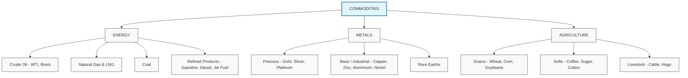

import Chart from '../../../components/Chart.astro';

**Commodities** are raw materials or primary agricultural products that can be bought and sold. Unlike financial instruments, they have **physical delivery** as a baseline, which fundamentally shapes their pricing dynamics. The commodity markets bridge the physical and financial worlds — oil is priced by tanker flows as much as by fund positioning.

---

## Commodity Classification

---

## Spot vs. Futures Markets

| Feature | Spot Market | Futures Market |
|---|---|---|
| Settlement | Immediate (varies by commodity) | Standardised future date |
| Delivery | Physical (usually) | Physical or cash-settled |
| Price | Immediate supply/demand | Expectations + cost of carry |
| Participants | Producers, consumers, traders | Above + speculators, hedgers |
| Venue | OTC, physical bilateral | Exchange (CME, ICE, LME) |

---

## Cost of Carry and Futures Pricing

For financial assets, the futures price is simply spot + financing cost. For physical commodities, **storage and convenience add complexity**:

$$
F = S \times e^{(r + u - y)T}
$$

**Where:**
*   **F** = Futures price
*   **S** = Spot price
*   **r** = Risk-free rate (financing cost)
*   **u** = Storage cost (annualised, as % of S)
*   **y** = Convenience yield (benefit of holding physical)
*   **T** = Time to maturity

**Arbitrage conditions:**
*   If $y > r + u$: $F < S$ → **Backwardation**
*   If $y < r + u$: $F > S$ → **Contango**

---

## Contango vs. Backwardation

The **shape of the futures curve** tells you about current supply/demand dynamics.

  

    <h4 style="text-align: center; margin-bottom: 0.5rem;">CONTANGO (Normal)</h4>
    <Chart id="contango" config={{
      type: 'line',
      data: {
        labels: ['Spot', '1M', '3M', '6M', '12M', '24M'],
        datasets: [{
          label: 'Price',
          data: [70, 72, 75, 78, 82, 86],
          borderColor: 'rgba(54, 162, 235, 1)',
          backgroundColor: 'rgba(54, 162, 235, 0.1)',
          fill: true,
          tension: 0.4,
          borderWidth: 2
        }]
      },
      options: {
        responsive: true,
        scales: {
          y: { title: { display: true, text: 'Price' } },
          x: { title: { display: true, text: 'Time to Delivery' } }
        },
        plugins: { legend: { display: false } }
      }
    }} />
    

      <strong>Causes:</strong> High storage costs, abundant near-term supply. 
      <strong>Roll yield:</strong> Negative (selling cheap, buying expensive).
    

  

  

    <h4 style="text-align: center; margin-bottom: 0.5rem;">BACKWARDATION (Inverted)</h4>
    <Chart id="backwardation" config={{
      type: 'line',
      data: {
        labels: ['Spot', '1M', '3M', '6M', '12M', '24M'],
        datasets: [{
          label: 'Price',
          data: [86, 82, 78, 75, 72, 70],
          borderColor: 'rgba(255, 99, 132, 1)',
          backgroundColor: 'rgba(255, 99, 132, 0.1)',
          fill: true,
          tension: 0.4,
          borderWidth: 2
        }]
      },
      options: {
        responsive: true,
        scales: {
          y: { title: { display: true, text: 'Price' } },
          x: { title: { display: true, text: 'Time to Delivery' } }
        },
        plugins: { legend: { display: false } }
      }
    }} />
    

      <strong>Causes:</strong> Low near-term supply, high convenience yield. 
      <strong>Roll yield:</strong> Positive (selling expensive, buying cheap).
    

  

### Backwardation (Inverted Market)

**Futures prices LOWER than spot**

Causes:
*   Low near-term supply (shortages)
*   High convenience yield (benefit of holding physical inventory)
*   Strong near-term demand

Roll cost for long futures holders:
*   Generates **POSITIVE roll yield** (selling expensive front month, buying cheaper back month)
*   Commodity producers often benefit from backwardation in their hedging.

---

## Macro Drivers for Commodities

1.  **US Dollar:** Strong inverse correlation (USD up → Commodities down) as most are priced in USD.
2.  **Global Growth:** Metals (Copper) and Energy demand sensitive to global GDP.
3.  **Inflation:** Commodities act as an inflation hedge (real assets).
4.  **Geopolitics:** Energy and Grains supply sensitive to conflicts.
5.  **Weather:** Primary driver for Agriculture and Natural Gas (winter heating).
