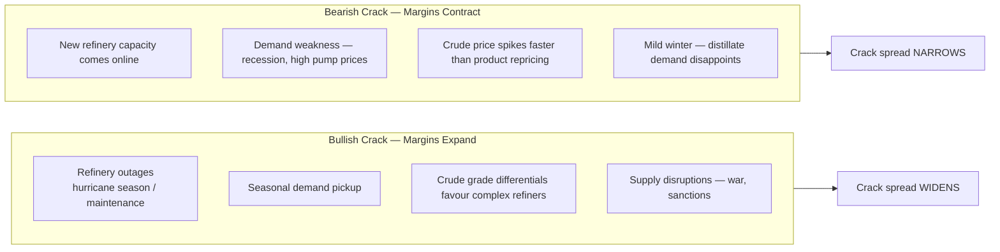
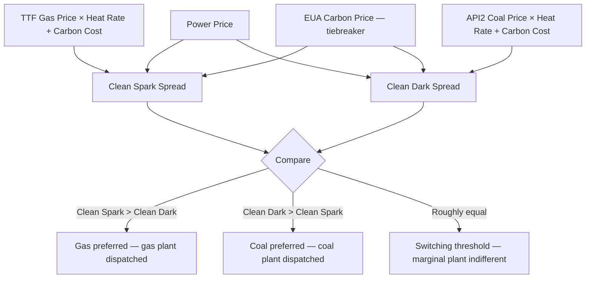

**Conversion margins** measure the profitability of transforming one energy commodity into another — crude into products, gas into power, coal into power. They are simultaneously commercial KPIs for energy producers and tradeable derivatives in their own right.

---

## Crack Spreads: Refining Economics

A **crack spread** is the difference between the price of crude oil inputs and the refined petroleum products output — measuring the gross refining margin.

### The 3-2-1 Crack Spread

The most widely traded crack spread approximates a simplified refinery that processes **3 barrels of crude** into **2 barrels of gasoline** and **1 barrel of heating oil (or distillate)**:

```
  3-2-1 Crack Spread:
  ─────────────────────────────────────────────────────────
  OUTPUTS:  2 barrels RBOB Gasoline + 1 barrel Heating Oil
  INPUT:    3 barrels WTI Crude Oil
```

$$\text{Crack}_{3\text{-}2\text{-}1} = \frac{2 \times \text{RBOB} + 1 \times \text{HO} - 3 \times \text{WTI}}{3}$$

All prices in \$/barrel (RBOB and HO quoted in \$/gallon → × 42).

Given: $\text{WTI} = \$80.00/\text{bbl}$, $\text{RBOB} = \$2.50/\text{gal} \times 42 = \$105.00/\text{bbl}$, $\text{HO} = \$2.80/\text{gal} \times 42 = \$117.60/\text{bbl}$

$$
\begin{align}
\text{Crack}_{3\text{-}2\text{-}1} &= \frac{(2 \times \$105.00) + (1 \times \$117.60) - (3 \times \$80.00)}{3} \\[6pt]
  &= \frac{\$210.00 + \$117.60 - \$240.00}{3} \\[6pt]
  &= \frac{\$87.60}{3} \\[6pt]
  &= \mathbf{\$29.20/\text{bbl}}
\end{align}
$$

- A refinery earns approximately \$29.20/bbl over crude costs
- This is the GROSS margin; operating costs are on top
- Typical refinery opex: \$3–8/bbl (energy, labour, maintenance)
- Net margin ≈ \$21–26/bbl in this example

### The 5-3-2 Crack Spread

A variation used for refineries with higher distillate yields:

```
  5-3-2 Crack Spread:
  INPUT:    5 barrels crude
  OUTPUTS:  3 barrels gasoline + 2 barrels distillate
```

$$\text{Crack}_{5\text{-}3\text{-}2} = \frac{3 \times \text{Gasoline} + 2 \times \text{Distillate} - 5 \times \text{Crude}}{5}$$

```
  Why 5-3-2 vs 3-2-1?
  → Complex refineries (with cokers, hydrocrackers) achieve higher
    distillate yield (jet, diesel, heating oil)
  → European refineries often use 1-1 crack (1:1 crude to diesel)
    because European demand is more diesel-heavy than gasoline
  → Seasonal: winter = higher distillate demand → 5-3-2 more relevant
```

### Seasonal Crack Spread Dynamics

```
  GASOLINE CRACK SPREADS:
  → Peak demand: May–September (US driving season)
  → Seasonal pre-build: refinery maintenance February–March
    → Supply falls → gasoline cracks spike in spring
  → RBOB crack: typically highest April–May

  DISTILLATE (HEATING OIL / DIESEL / JET) CRACK SPREADS:
  → Peak demand: October–February (northern hemisphere winter heating)
  → Also high: summer jet fuel demand
  → Distillate crack spikes: cold snaps, supply disruptions

  2022 Diesel Crack Spike:
  → European diesel supply disrupted (Russia sanctions)
  → Diesel crack spread reached $60–90/bbl (vs. historical $15–25/bbl)
  → Refineries ran at max capacity; new refinery capacity lagged
  → Structural shortage of complex distillate-heavy refinery capacity

  Typical range (2015–2022 average):
  3-2-1 crack: $12–20/bbl (average)
  Post-2022:  $25–40/bbl (structural margin expansion)
```

### Trading Crack Spreads

NYMEX Crack Spread Futures: CME offers "crack spread" combinations as single instruments, or leg it manually (short crude futures, long product futures).

**Long crack** (long products, short crude): benefits when refining margins expand — classic trade ahead of driving season or winter.

**Short crack** (short products, long crude): benefits when refining margins contract — when crude costs rise faster than products, or refinery capacity returns.



---

## Spark Spreads: Gas-to-Power Economics

The **spark spread** measures the profitability of burning natural gas to generate electricity:

$$\text{Spark Spread} = \text{Electricity Price} - (\text{Gas Price} \times \text{Heat Rate})$$

```
  Where:
  Electricity Price = $/MWh (power market)
  Gas Price         = $/MMBtu (natural gas)
  Heat Rate         = MMBtu of gas needed per MWh of electricity
                      (efficiency measure; typical CCGT: 7–8 MMBtu/MWh)
```

Given: Power price $= £120/\text{MWh}$, gas price $\approx £3.93/\text{MMBtu}$ (converted from 100 p/therm), heat rate $= 7.5\ \text{MMBtu/MWh}$

$$
\begin{align}
\text{Spark Spread} &= £120/\text{MWh} - (£3.93/\text{MMBtu} \times 7.5\ \text{MMBtu/MWh}) \\[6pt]
  &= £120 - £29.48 \\[6pt]
  &= \mathbf{£90.52/\text{MWh}}
\end{align}
$$

This was an extremely profitable level during the 2022 energy crisis. Normal range (UK): £5–20/MWh; 2022 peak: £80–150/MWh.

### Clean Spark Spread

The **clean spark spread** accounts for the carbon cost under emissions trading schemes (EU ETS, UK ETS):

$$\text{Clean Spark Spread} = \text{Spark Spread} - (\text{Carbon Intensity} \times \text{Carbon Price})$$

Carbon intensity of gas-fired power: ~0.40 tCO₂/MWh (CCGT).

Given: spark spread $= £90/\text{MWh}$, carbon intensity $= 0.40\ \text{tCO}_2/\text{MWh}$, carbon price $= £50/\text{tCO}_2$ (EU ETS)

$$
\begin{align}
\text{Carbon cost} &= 0.40\ \text{tCO}_2/\text{MWh} \times £50/\text{tCO}_2 = £20/\text{MWh} \\[6pt]
\text{Clean Spark Spread} &= £90/\text{MWh} - £20/\text{MWh} \\[6pt]
  &= \mathbf{£70/\text{MWh}}
\end{align}
$$

Why it matters:
- Post-EU ETS, carbon cost is now a significant input
- A clean spark spread >0 means gas generation is profitable AFTER paying for emissions
- Clean spark spread <0 means gas plants run at a loss and may choose not to generate ("economic shutdown")

---

## Dark Spreads: Coal-to-Power Economics

The **dark spread** measures profitability of burning coal to generate electricity:

$$\text{Dark Spread} = \text{Electricity Price} - (\text{Coal Price} \times \text{Heat Rate})$$

Coal heat rate: typically 9–10 MMBtu/MWh (less efficient than gas — coal plants are less thermally efficient than modern CCGT).

Given: coal price $= \$150/\text{tonne}$, heat rate $= 9.5\ \text{MMBtu/MWh}$, coal energy content $= 26.1\ \text{MMBtu/tonne}$, power price $= \$80/\text{MWh}$

$$
\begin{align}
\text{Coal cost per MWh} &= \frac{\$150/\text{tonne}}{26.1\ \text{MMBtu/tonne}} \times 9.5\ \text{MMBtu/MWh} \\[6pt]
  &= \$5.747/\text{MMBtu} \times 9.5 = \$54.60/\text{MWh} \\[6pt]
\text{Dark Spread} &= \$80.00 - \$54.60 = \mathbf{\$25.40/\text{MWh}}
\end{align}
$$

Carbon intensity of coal: ~0.95 tCO₂/MWh (much higher than gas).

At carbon price $= \$50/\text{tCO}_2$:

$$
\begin{align}
\text{Carbon cost} &= 0.95\ \text{tCO}_2/\text{MWh} \times \$50/\text{tCO}_2 = \$47.50/\text{MWh} \\[6pt]
\text{Clean Dark Spread} &= \$25.40 - \$47.50 \\[6pt]
  &= \mathbf{-\$22.10/\text{MWh}} \quad \leftarrow \text{LOSS}
\end{align}
$$

Coal-fired power is uneconomic when carbon prices are high.

---

## Fuel Switching and the Spark-Dark Spread Relationship

The **spark-dark spread comparison** drives fuel switching decisions:



---

## The Refinery Margin and Crude Quality Premium

Different crude grades yield different product slates, creating quality differentials:

```
  CRUDE QUALITY FACTORS:
  ─────────────────────────────────────────────────────────
  API gravity (°API):
  → Higher API = lighter crude = more gasoline/naphtha yield
  → Lower API = heavier crude = more fuel oil yield

  Sulfur content:
  → "Sweet" (<0.5% sulfur): WTI, Brent, Bonny Light
  → "Sour" (>0.5% sulfur): Saudi Arab Light/Heavy, Dubai, Ural

  Yield comparison (approximate):
  ┌────────────────────────────────────────────────────────┐
  │ Product        Light Sweet (%)  Heavy Sour (%)         │
  │ LPG/Naphtha    8%               5%                     │
  │ Gasoline       22%              17%                     │
  │ Jet/Kerosene   10%              9%                      │
  │ Diesel/HO      30%              22%                     │
  │ Fuel Oil       15%              30%                     │
  │ Residue/Other  15%              17%                     │
  └────────────────────────────────────────────────────────┘

  → Light sweet crude yields more high-value products (gasoline, jet)
  → Heavy sour crude yields more low-value fuel oil
  → Simple refineries (no conversion units): prefer light sweet
  → Complex refineries (cokers, hydrocrackers): can profitably run heavy sour
    and convert fuel oil to distillates → earn the "complexity premium"

  Complexity premium:
  When crack spreads are wide, complex refineries earn more:
  → Difference between light sweet and heavy sour crude =
    "crude quality differential" (varies $5–20/bbl)
  → Nelson Complexity Index (NCI): measures refinery upgrade level
    → NCI of 3–5: simple distillation only
    → NCI of 10+: full conversion (coking, hydrocracking)
```

---

## Further Reading

- CME Group: *Crude Oil and Petroleum Products Crack Spread Handbook* — cmegroup.com
- EIA: *What Drives Crack Spreads* — eia.gov
- *An Introduction to Energy Markets* — Elsevier (various authors)
- ICIS: *European Power Market Spark and Dark Spread Analysis*
- Oxford Energy Institute: *Natural Gas and Electricity Market Interactions*
- *Energy Trading and Investing* — Davis W. Edwards (McGraw-Hill, 2009)
