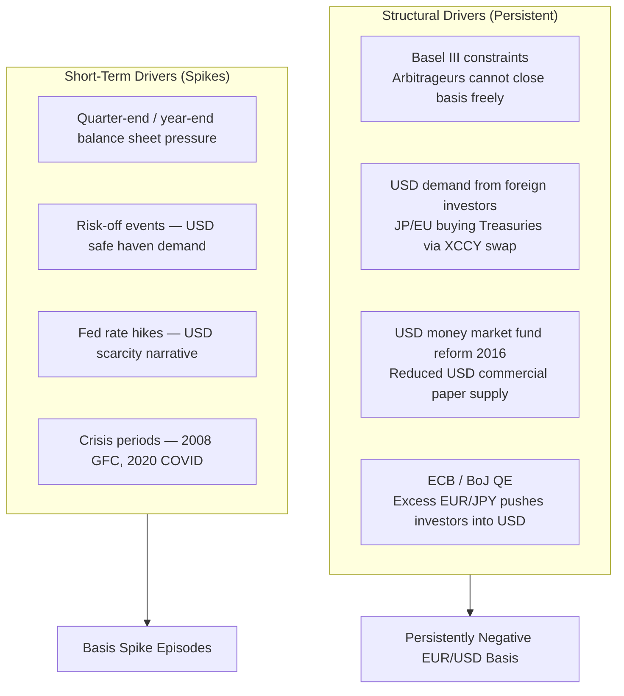

A **cross-currency swap (XCCY)** is a long-dated agreement between two parties to exchange interest payments and principal in two different currencies over the life of the swap, with the principal re-exchanged at maturity at the **original spot rate**. Unlike an FX swap, it is not primarily a short-term funding tool — tenors typically range from **1 to 30 years**.

---

## Structure

```
  ┌──────────────────────────────────────────────────────────────────┐
  │                    CROSS-CURRENCY BASIS SWAP                     │
  │                                                                  │
  │  START:                                                          │
  │  Party A ──── pays USD notional (e.g. $108.5m) ────► Party B    │
  │  Party A ◄─── receives EUR notional (e.g. €100m) ─── Party B    │
  │                                                                  │
  │  DURING (quarterly, e.g.):                                       │
  │  Party A ──── pays USD SOFR ───────────────────────► Party B    │
  │  Party A ◄─── receives EUR €STR + basis (α) ──────── Party B    │
  │                                                                  │
  │  MATURITY:                                                       │
  │  Party A ◄─── receives USD notional ($108.5m) ─────── Party B   │
  │  Party A ──── pays EUR notional (€100m) ───────────► Party B    │
  │                                                                  │
  │  Note: Re-exchange at ORIGINAL spot rate (not current rate)      │
  └──────────────────────────────────────────────────────────────────┘
```

---

## The Cross-Currency Basis (α)

In a perfect CIP world, the basis **α = 0**. In practice, it is **almost always non-zero** — and has been persistently negative for EUR, JPY, GBP, and AUD vs. USD since the 2008 Global Financial Crisis.

```
  Standard XCCY trade (e.g. EUR/USD 5Y basis):

  Party pays USD SOFR flat
  Party receives EUR €STR + α (where α = cross-currency basis)

  If α = −20bps:
    Receiver gets EUR €STR − 20bps
    This negative basis means USD funding via FX swap is MORE EXPENSIVE
    than directly borrowing USD — you effectively "pay" 20bps to get USD
```

### What the Basis Measures

| Basis Sign | Meaning |
|---|---|
| **α = 0** | CIP holds; no arbitrage |
| **α < 0** | USD is scarce; demand for synthetic USD exceeds supply |
| **α > 0** | USD is abundant; rare; seen in some EM dollar gluts |

---

## Why the Basis Exists

Before 2008, the EUR/USD basis was approximately zero. Post-GFC, it has been persistently negative, driven by:



---

## CIP Deviation Visualisation

```
  EUR/USD Cross-Currency Basis (5Y)
  ─────────────────────────────────
  2006:  ≈  0 bps   (CIP roughly holds)
  2008:  ≈ −160 bps (GFC crisis — massive USD scarcity)
  2012:  ≈ −50 bps  (Euro sovereign crisis)
  2015:  ≈ −30 bps  (BoJ/ECB QE, USD demand)
  2020:  ≈ −80 bps  (COVID-19 March flash)
  2022:  ≈ −20 bps  (Post-COVID normalisation, still negative)

  Basis (bps)
   20 │
    0 │──────────────────────────────────────────── CIP
  -40 │            ╲          ╱    ╲
  -80 │             ╲        ╱      ╲_____
 -120 │              ╲      ╱
 -160 │               ╲____/ (GFC peak)
      └─────────────────────────────────────────── Time
       2006  2008  2010  2012  2014  2016  2018  2020  2022
```

---

## XCCY Swap Types

### 1. Fixed-Fixed (Currency Swap)
Both legs pay a fixed coupon. Used for long-dated bond hedging by corporates issuing in a foreign currency.

```
  Corporation issues EUR bond → pays fixed EUR coupon
  Enters Fixed-Fixed XCCY swap:
    Pays fixed USD coupon to bank
    Receives fixed EUR coupon from bank (offsets bond payment)
  Net: synthetic USD fixed-rate borrowing
```

### 2. Fixed-Floating
One leg fixed, one leg floating. Often used by corporates wanting to convert fixed-rate foreign debt to floating domestic.

### 3. Floating-Floating (Basis Swap)
Both legs are floating rate (SOFR vs €STR + basis). This is the **standard interbank form**.

### 4. Resettable / MTM Cross-Currency Swap
To manage mark-to-market risk from FX rate moves, the **notional is reset periodically** (quarterly) to current FX rates, with a cash USD payment to settle the difference:

```
  At each reset date:
  New USD notional = EUR notional × new EUR/USD spot
  Cash settled: (New USD notional − Old USD notional) paid in USD

  → Eliminates large MTM swings; dominant in interbank market
```

---

## Post-LIBOR: RFR Cross-Currency Swaps

Since the LIBOR transition (2021–2023), XCCY swaps now reference **overnight risk-free rates (RFRs)**:

| Currency | RFR |
|---|---|
| USD | SOFR (Secured Overnight Financing Rate) |
| EUR | €STR (Euro Short-Term Rate) |
| GBP | SONIA (Sterling Overnight Index Average) |
| JPY | TONA (Tokyo Overnight Average Rate) |
| CHF | SARON (Swiss Average Rate Overnight) |

**Convention (as of 2023)**:
- ~95% of XCCY swaps now trade RFR vs RFR (Clarus FT data)
- Coupons: quarterly, compounded in arrears
- 2-day payment lag
- Initial and final exchange of notional at original spot rate

---

## Key Use Cases

| User | Use Case |
|---|---|
| **European / Japanese banks** | Swap EUR/JPY into USD to fund USD asset portfolios |
| **Multinational corporates** | Convert foreign currency bond issuance to domestic currency |
| **Sovereign wealth funds** | Currency-hedge foreign bond investments over multi-year horizon |
| **Asset managers** | Long-dated currency hedge for international bond portfolios |
| **Central banks** | Dollar swap lines in crises |

---

## Practical Example: Japanese Life Insurer Hedging USD Bonds

A Japanese life insurer buys $1 billion of US Treasury bonds. To hedge the USD exposure over 10 years:

```
  1. Buys USD Treasuries (receives USD coupons + principal)
  2. Enters XCCY swap:
      → Pays USD SOFR to counterparty
      → Receives JPY TONA + basis from counterparty
      → Exchanges $1bn for ¥148bn at inception
      → Re-exchanges at same ¥/$ rate at maturity

  Net position:
      → JPY cash flows in (hedged)
      → USD coupon received from Treasuries offsets USD SOFR paid
      → Life insurer has synthetic JPY fixed income exposure
      → Exposed to: XCCY basis moves, credit risk on swap counterparty
```

---

## FX Swap vs. Cross-Currency Swap

| Feature | FX Swap | Cross-Currency Swap |
|---|---|---|
| Tenor | Short-term (O/N to 1Y) | Long-term (1Y to 30Y+) |
| Interest payments | None (embedded in forward pts) | Yes — periodic coupon exchange |
| Notional exchange | Both legs at start & end | Start and end (resettable MTM variant available) |
| Reference rate | N/A (forward points) | SOFR, €STR, SONIA, etc. + basis |
| Primary use | Funding, rolling hedges | Long-dated FX hedging, bond issuance |
| Regulation | Less regulated (FX product) | OTC derivative (EMIR/Dodd-Frank) |

---

## Further Reading

- BIS: *The basic mechanics of FX swaps and cross-currency basis swaps* — [bis.org/publ/qtrpdf/r_qt0803z.htm](https://www.bis.org/publ/qtrpdf/r_qt0803z.htm)
- BIS: *Covered interest parity lost* — [bis.org/publ/qtrpdf/r_qt1609e.htm](https://www.bis.org/publ/qtrpdf/r_qt1609e.htm)
- Clarus FT: *Mechanics of Cross Currency Swaps* — [clarusft.com](https://www.clarusft.com/mechanics-of-cross-currency-swaps/)
- ECB Occasional Paper: *Role of cross currency swap markets in funding* — [ecb.europa.eu](https://www.ecb.europa.eu/pub/pdf/scpops/ecb.op228~bb3e50120a.en.pdf)
