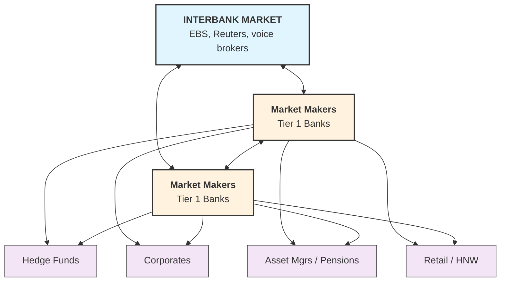

The foreign exchange (FX) market is the largest and most liquid financial market in the world, with daily trading volumes exceeding **$7.5 trillion** (BIS Triennial Survey, 2022). It operates 24 hours a day, five days a week across global financial centres, with no central exchange.

---

## Market Structure

Unlike equities or futures, FX trades **over-the-counter (OTC)** — bilaterally between counterparties rather than on a centralised exchange. This creates a decentralised, dealer-driven market.



---

## Key Participants

| Participant | Role | Typical Motivation |
|---|---|---|
| **Central Banks** | Policy intervention, reserve management | Monetary policy, FX stability |
| **Tier 1 Banks** | Market making, proprietary trading | Bid/offer spread, flow |
| **Hedge Funds** | Speculative directional & relative value | Alpha generation |
| **Corporates** | Hedging receivables/payables | FX risk management |
| **Asset Managers** | Currency overlay, hedging | Portfolio risk/return |
| **Retail / HNW** | Speculative trading | Profit |

---

## Market Sessions

FX trading is global and continuous. Liquidity peaks when sessions overlap.

```mermaid
%%{init: { 'gantt': { 'barHeight': 35, 'fontSize': 16 } } }%%
gantt
    title Global FX Market Sessions (UTC)
    dateFormat  HH:mm
    axisFormat  %H:%M
    
    section APAC
    Sydney (22:00-07:00) :a1, 22:00, 9h
    Tokyo (23:00-08:00)  :a2, 23:00, 9h
    
    section Europe
    London (07:00-16:00) :a3, 07:00, 9h
    
    section Americas
    New York (13:00-22:00) :a4, 13:00, 9h
    
    section Peak Liquidity
    London / NY Overlap :crit, a5, 13:00, 3h
```

<div style="overflow-x: auto; padding: 1rem 0;">
  <div style="min-width: 700px;">



  </div>
</div>

- **Most liquid pair**: EUR/USD (~24% of global volume)
- **Most liquid session**: London (accounts for ~38% of global volume)

---

## Currency Conventions

### Quoting Convention
FX rates are quoted as **Base / Quote** (or Price currency):

```
  EUR / USD  =  1.0850
  ───┬───      ───┬───
  Base          Quote
(1 EUR buys  (number of USD
 this many)   per 1 EUR)
```

- **Direct quote**: Domestic currency in the denominator (e.g., USD/JPY for a US resident)
- **Indirect quote**: Foreign currency in the denominator

### Major, Minor, and Exotic Pairs

| Category | Examples | Characteristics |
|---|---|---|
| **Majors** | EUR/USD, USD/JPY, GBP/USD, USD/CHF | Highest liquidity, tightest spreads |
| **Minors / Crosses** | EUR/GBP, AUD/JPY, CAD/CHF | No USD leg; slightly wider spreads |
| **EM / Exotics** | USD/TRY, USD/BRL, USD/ZAR | Lower liquidity, higher volatility, wider spreads |

### Pips and Ticks
A **pip** (percentage in point) is the smallest standard price move:
- Most pairs: 4th decimal place — 1 pip = 0.0001 (e.g., EUR/USD 1.0850 → 1.0851)
- JPY pairs: 2nd decimal place — 1 pip = 0.01 (e.g., USD/JPY 149.50 → 149.51)
- A **pipette** or **point** = 5th decimal (fractional pip), quoted on electronic platforms

---

## Settlement

Most FX transactions settle on a **T+2** basis (trade date + 2 business days), known as **spot value date**. Exceptions:

| Pair | Standard Settlement |
|---|---|
| USD/CAD | T+1 |
| USD/TRY, USD/RUB | T+1 |
| All others (majors) | T+2 |

Trades settling on the same day are called **cash** or **value today (TOD)**; next day is **value tomorrow (TOM)**.

---

## Key Instruments at a Glance

| Instrument | Description |
|---|---|
| **Spot** | Exchange of currencies at current rate, T+2 settlement |
| **Forward Outright** | Exchange at agreed rate on a future date |
| **FX Swap** | Combination of spot and forward (near + far leg) |
| **Cross-Currency Swap** | Long-dated exchange of cashflows in two currencies |
| **Vanilla Option** | Right but not obligation to buy/sell at a strike |
| **Exotic Option** | Path-dependent or structured payoff options |
| **Structured Product** | Packaged products combining deposits + options |

---

## Regulation & Infrastructure

Post-2008 reforms (Dodd-Frank, EMIR) pushed OTC derivatives toward central clearing, compression, and trade reporting. However:
- **Spot FX** remains largely unregulated as an FX transaction
- **FX derivatives** (forwards, swaps, options) fall under derivatives regulations
- Clearing houses: **LCH ForexClear**, **CME FX Link**
- Prime brokerage allows hedge funds to access interbank liquidity via a prime broker's credit lines

---

## Further Reading

- BIS Triennial Central Bank Survey (2022) — [bis.org](https://www.bis.org/statistics/rpfx22.htm)
- *Options, Futures, and Other Derivatives* — John C. Hull (10th ed.)
- *Foreign Exchange: A Practical Guide to the FX Markets* — Tim Weithers
