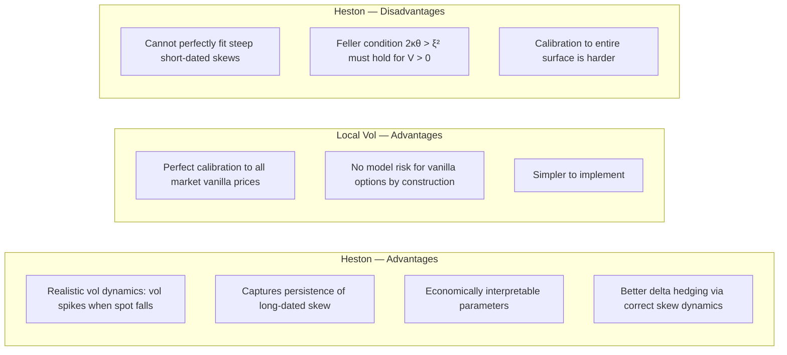
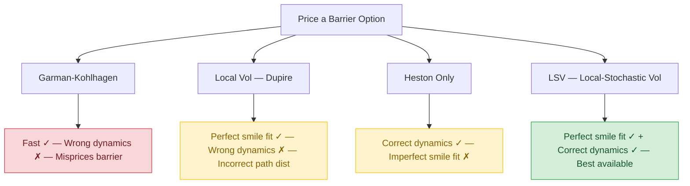

Garman-Kohlhagen (GK) — the FX adaptation of Black-Scholes — is the market standard for quoting and communicating vanilla option prices via implied volatility. But for **pricing exotic and path-dependent options**, GK fails in critical ways. This page covers the hierarchy of models that replace it.

---

## Why Garman-Kohlhagen Fails for Exotics

```
  GK assumption: σ is constant across all strikes and maturities
  Reality: σ varies — the vol surface exists

  For vanilla options, this doesn't matter much:
  → We "solve for" IV from market prices (back out sigma)
  → GK is used as a quoting convention, not a belief in constant vol

  For path-dependent exotics (barriers, Asians, TARFs), it matters enormously:
  → The exotic payoff depends on the entire PATH of the spot rate
  → A barrier option's value depends on HOW spot gets to the barrier
  → GK says all paths are equally likely (log-normal with flat vol)
  → Reality: vol changes as spot moves → the path distribution is wrong

  Consequence:
  Two banks using GK for the same barrier option can produce prices
  differing by 20–40% — because they disagree on how vol should move
  as spot approaches the barrier.
```

---

## Local Volatility: Dupire's Model (1994)

**Local volatility** solves the first problem: it makes volatility a **deterministic function of spot and time** — σ(S, t) — perfectly consistent with every vanilla option price on the surface.

### Intuition

```
  Black-Scholes:          σ = constant for all S and t
  Local Volatility:       σ = σ(S, t) — a different vol for every (spot, time) pair

  Think of the local vol surface as a terrain map:
  Each point on the map [spot level, date] has its own assigned volatility.
  The model says: "when spot is at level X on date T,
                   it will behave with volatility σ(X,T)"

  → Perfectly calibrated to all market vanilla prices (by construction)
  → The surface exactly reproduces the market's risk-neutral density
```

### Dupire's Formula

Dupire (1994) showed that if you know all European call prices C(K, T) for every strike K and maturity T, the local volatility is uniquely determined:

$$
\sigma^2(K,T) = \frac{\partial C/\partial T + (r_d - r_f) K \,\partial C/\partial K + r_f C}{\tfrac{1}{2} K^2 \,\partial^2 C/\partial K^2}
$$

Where:
- $C(K,T)$ = market price of European call with strike $K$, maturity $T$
- $\partial C/\partial T$ = slope of call price vs. maturity ("calendar spread" sensitivity)
- $\partial C/\partial K$ = slope vs. strike
- $\partial^2 C/\partial K^2$ = second derivative vs. strike (risk-neutral probability density)
- $r_d, r_f$ = domestic and foreign interest rates

> Reference: Dupire, B. (1994). *Pricing with a Smile.* Risk Magazine, 7(1), 18–20.

### The Forward PDE

Instead of pricing backwards from expiry (backward PDE), Dupire derived a **forward PDE** that propagates prices forward from today:

$$
\frac{\partial C}{\partial T} = \tfrac{1}{2}\sigma^2(K,T)\,K^2\,\frac{\partial^2 C}{\partial K^2} - (r_d - r_f)\,K\,\frac{\partial C}{\partial K} - r_f C
$$

- Fix today's spot and time $(S_0, t_0)$
- Solve **forward** across all maturities $T$ and strikes $K$
- Dramatically more efficient for pricing many options at once

### Local Vol in Practice: Limitations

```
  Problem 1: Volatility dynamics
  Local vol implies a SPECIFIC dynamic: as spot falls, vol DECREASES
  (because the vol surface is sticky in strike space)

  Reality: When spot falls, vol typically INCREASES (inverse correlation)
  → Local vol gets the "skew dynamics" backward
  → Delta hedging with local vol is less accurate than with stoch vol

  Problem 2: Calibration instability
  → Dupire's formula requires smooth derivatives of option prices
  → In practice, options are quoted at discrete (K, T) points
  → Requires careful interpolation → small errors in the surface
    produce large errors in local vol (especially in tails)

  Problem 3: Forward skew
  → Local vol predicts declining skew for longer-dated options
  → Does not match the persistence of long-term skew observed in markets
  → Heston model handles this better
```

---

## Stochastic Volatility: The Heston Model (1993)

**Stochastic volatility (SV) models** treat volatility itself as a random variable with its own dynamics — far more realistic than GK or local vol.

### The Heston Model Equations

**Asset process:**
$$
dS = (r_d - r_f) S \, dt + \sqrt{V} S \, dW_1
$$

**Variance process (mean-reverting):**
$$
dV = \kappa(\theta - V) dt + \xi \sqrt{V} \, dW_2
$$

**Correlation:**
$$
dW_1 \cdot dW_2 = \rho \, dt
$$

**Parameters:**
*   $\kappa$ = mean reversion speed (how fast vol returns to $\theta$)
*   $\theta$ = long-term variance (long-run average $\text{vol}^2$)
*   $\xi$ = volatility of volatility ("vol of vol")
*   $\rho$ = correlation between spot and vol processes
*   $V_0$ = initial variance (current instantaneous $\text{vol}^2$)

> Reference: Heston, S.L. (1993). *A Closed-Form Solution for Options with Stochastic Volatility.* Review of Financial Studies, 6(2), 327–343.

### Parameter Intuition

```
  κ (mean reversion speed):
  High κ: vol snaps back to long-run mean quickly
           → shorter-dated options dominated by current vol
  Low κ:  vol wanders more
           → longer-dated options capture more of the uncertainty

  θ (long-term variance):
  The "gravity" level. If current vol is above θ, it drifts down.
  If below θ, it drifts up.
  √θ = long-run average ATM implied vol

  ξ (vol of vol):
  Controls the "fatness" of the wings (butterfly / kurtosis)
  High ξ: fat tails → OTM options expensive
  Low ξ:  thin tails → OTM options cheap

  ρ (spot-vol correlation):
  ρ < 0: When spot falls, vol rises (typical for FX/equities)
          → Creates NEGATIVE SKEW (put wing expensive)
  ρ > 0: When spot rises, vol rises
          → Creates POSITIVE SKEW (call wing expensive)
  ρ = 0: Symmetric smile

  In FX: ρ is typically negative (−0.2 to −0.6 for USD/EM)
  explaining the persistent put skew in those pairs
```

### Heston's Characteristic Function Solution

Heston's breakthrough was deriving a **semi-closed-form solution** via characteristic functions:

```
  Call price = S·e^(−r_f·T)·P₁ − K·e^(−r_d·T)·P₂

  Where P₁ and P₂ are risk-neutral probabilities computed via
  inverse Fourier transform of the characteristic function:

  φ(u) = exp{C(u,T) + D(u,T)·V₀ + i·u·ln(F)}

  The key insight: the characteristic function is known in
  closed form → fast numerical computation via FFT
  → Can price thousands of options in milliseconds
```

### Heston vs. Local Vol: What Each Captures



---

## Local-Stochastic Volatility (LSV): The Industry Standard

In practice, major FX options desks use **Local-Stochastic Volatility (LSV)** models — combining the best of both worlds.

```
  LSV model:
  dS/S = (r_d − r_f)dt + L(S,t)·√V·dW₁

  Where:
  L(S,t) = leverage function (the local vol component)
  √V      = stochastic vol component (Heston-type)

  The leverage function L(S,t) is calibrated to ensure
  perfect fit to market vanilla prices, WHILE the stochastic
  vol component drives realistic dynamics.

  Calibration procedure:
  Step 1: Calibrate Heston parameters to roughly fit the smile
  Step 2: Solve for L(S,t) using the Fokker-Planck equation
          to make the combined model perfectly calibrate to
          all market vanilla prices
  Step 3: Use Monte Carlo simulation with the LSV dynamics
          to price exotic options
```

### Why LSV Is Necessary



---

## SABR Model: The Interest Rate/FX Practitioner's Favourite

The **SABR model** (Hagan et al., 2002) is widely used for interest rate and FX options because it has:
1. An **analytic approximation** for implied vol (no need for Fourier methods)
2. Natural fit to market-observed vol smiles

**SABR dynamics:**
$$
dF = \alpha \cdot F^\beta \cdot dW_1
$$
$$
d\alpha = \nu \cdot \alpha \cdot dW_2
$$
$$
dW_1 \cdot dW_2 = \rho \, dt
$$

**Parameters:**
*   $\alpha$ = initial volatility
*   $\beta$ = CEV parameter (0 = normal, 1 = log-normal)
*   $\rho$ = correlation (skew driver)
*   $\nu$ = vol of vol (smile curvature driver)

**SABR implied vol approximation (Hagan 2002):**
$\sigma(K) \approx \text{analytic formula in terms of } (\alpha, \beta, \rho, \nu, F, K, T)$

→ Standard in interest rate derivatives desks
→ Used in FX for longer-dated options and emerging markets

---

## Model Risk Summary

```
  Model risk is the risk of loss from using an incorrect model.

  For FX exotics, the key model risks are:
  ┌─────────────────────────────────────────────────────────────┐
  │ 1. Skew dynamics: how vol responds as spot moves            │
  │    → Local vol: wrong direction; stoch vol: correct         │
  │ 2. Forward skew: what the smile looks like in the future    │
  │    → Only stoch vol captures long-run skew persistence      │
  │ 3. Tail extrapolation: vol beyond the 10D market quote      │
  │    → Pure extrapolation; high model uncertainty             │
  │ 4. Correlation structure: multi-asset products              │
  │    → Requires multivariate models; calibration difficult    │
  └─────────────────────────────────────────────────────────────┘

  Bank practice: price with LSV, charge a model risk reserve
  for residual model uncertainty on complex products
```

---

## Further Reading

- Dupire, B. (1994). *Pricing with a Smile.* Risk Magazine, 7(1), 18–20.
- Heston, S.L. (1993). *A Closed-Form Solution for Options with Stochastic Volatility.* Review of Financial Studies, 6(2).
- Hagan, P. et al. (2002). *Managing Smile Risk.* Wilmott Magazine.
- Wikipedia: *Local Volatility* — [en.wikipedia.org](https://en.wikipedia.org/wiki/Local_volatility)
- Gatheral, J. (2006). *The Volatility Surface.* Wiley Finance.
- Columbia University: *Local Volatility, Stochastic Volatility, and Jump-Diffusion* — [columbia.edu](http://www.columbia.edu/~mh2078/ContinuousFE/LocalStochasticJumps.pdf)
