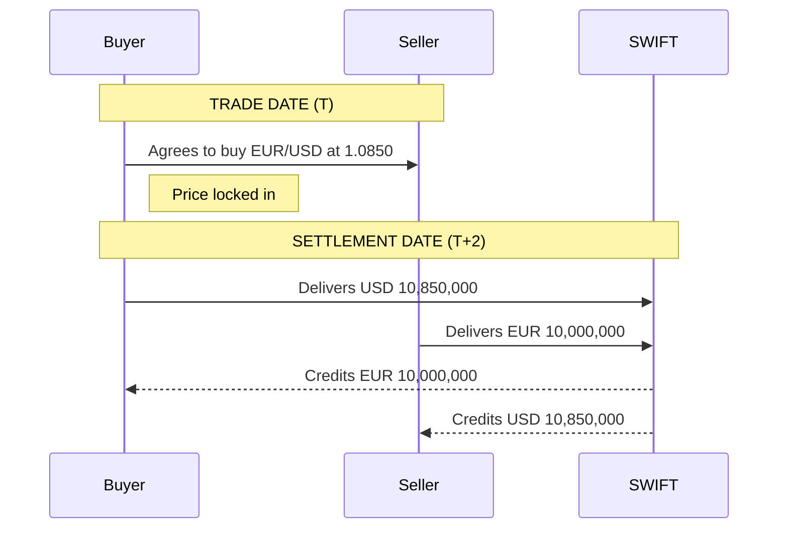

A **spot FX transaction** is the purchase or sale of one currency against another for delivery on the standard settlement date — typically **T+2 business days** from the trade date. It is the foundational building block from which all other FX products are priced.

---

## How a Spot Trade Works

### Example
> A corporate buys €10,000,000 spot against USD at EUR/USD 1.0850.
> *   **EUR received:** €10,000,000
> *   **USD paid:** $10,850,000
> *   **Settlement:** 2 business days after trade date

---

## Bid / Offer Spread

Market makers quote a **two-way price**: the **bid** (price to buy base) and the **offer/ask** (price to sell base). The spread is the market maker's compensation for providing liquidity.

:::note[Market Quote: EUR/USD]
**1.08498 / 1.08502**
*   **BID (1.08498):** Bank buys EUR / Client sells EUR
*   **ASK (1.08502):** Bank sells EUR / Client buys EUR

$$
\text{Spread} = 1.08502 - 1.08498 = 0.00004 = 0.4 \text{ pips}
$$
:::

**Spread determinants:**
*   **Liquidity:** EUR/USD may trade 0.1–0.5 pips; EM pairs can be 20–200+ pips.
*   **Volatility:** Spreads widen sharply during risk events (NFP, FOMC).
*   **Deal size:** Large tickets may move through the spread or require voice execution.

---

## Lot Sizes

| Lot Type | Size | Typical User |
|---|---|---|
| Standard Lot | 100,000 units of base | Institutional |
| Mini Lot | 10,000 units | Small institutional / active retail |
| Micro Lot | 1,000 units | Retail |
| Custom | Any notional | OTC / bilateral |

In the interbank market, the minimum is typically **USD 1–5 million** per ticket.

---

## Price Discovery

Spot FX prices are formed through a **continuous two-sided auction** process:

1.  **ECNs (Electronic Communication Networks):** EBS (CME Group), Reuters Matching — primary interdealer venues for EUR/USD, USD/JPY.
2.  **SDPs (Single-Dealer Platforms):** Banks' proprietary platforms (e.g., Citi Velocity, UBS Neo).
3.  **MDPs (Multi-Dealer Platforms):** FXall, Bloomberg FX, 360T — aggregated liquidity for clients.
4.  **Voice Brokers:** Still used for large tickets and EM currencies.

### The Spread Ecology
*   **Interbank spread (EBS/Reuters):** 0.1 – 0.3 pips
*   **Tier 1 Bank to client:** 0.3 – 1.0 pips
*   **Multi-dealer platform:** 0.5 – 2.0 pips
*   **Retail broker (retail client):** 1.0 – 3.0 pips

---

## Cross Rates

**Cross rates** are currency pairs with no USD leg, derived from two USD pairs:

$$
\text{EUR/GBP} = \frac{\text{EUR/USD}}{\text{GBP/USD}}
$$

**Example:**
*   EUR/USD = 1.0850
*   GBP/USD = 1.2700
*   EUR/GBP = $1.0850 / 1.2700 = 0.8543$

**Why it matters:** In thin EM crosses (e.g., EUR/ZAR), price is derived by crossing EUR/USD × USD/ZAR. Wider compounded spreads can result.

---

## Key Terms Summary

| Term | Meaning |
|---|---|
| **Base Currency** | The first currency in a pair (e.g., EUR in EUR/USD) |
| **Quote Currency** | The second currency in a pair (e.g., USD in EUR/USD) |
| **Pip** | Smallest standard unit of price move (typically 0.0001) |
| **Value Date** | The date on which the actual exchange of funds occurs |
| **CLS (Continuous Linked Settlement)** | System that mitigates settlement risk in the FX market |
| **Fixing** | Benchmark FX rate set at a specific time (e.g., WMR 4 PM Fix) |
