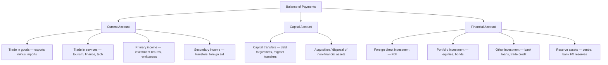

Short-term FX is driven by rate differentials and risk sentiment. Long-term FX valuation is anchored by deeper structural forces: the relative price levels of economies (PPP), the flows of trade and capital across borders (BoP), and the credibility characteristics that define safe havens.

---

## Purchasing Power Parity (PPP)

**Purchasing Power Parity** is the oldest and most theoretically grounded FX valuation theory, rooted in the **Law of One Price**: identical goods should cost the same in all countries when expressed in a common currency.

### Absolute PPP

$$S_{\text{PPP}} = \frac{P_{\text{domestic}}}{P_{\text{foreign}}}$$

```
  Where P = price level (GDP deflator or CPI)

  If a basket of goods costs $100 in the US and £75 in the UK:
  PPP-implied rate = $100 / £75 = 1.333 USD/GBP

  If the actual exchange rate is 1.50 USD/GBP:
  → GBP is OVERVALUED by ~12% vs. PPP
  → Theory: GBP should depreciate over time toward PPP
```

### Relative PPP

More practical: exchange rate changes equal inflation differentials.

$$\Delta S \approx \pi_{\text{domestic}} - \pi_{\text{foreign}}$$

```
  If US inflation = 4%, Eurozone inflation = 2%:
  → EUR/USD should appreciate by 2% per year (EUR "cheaper" inflation)
  → Equivalently: USD should weaken 2% per year

  Why relative PPP holds (eventually):
  → Cheaper goods attract imports → more demand for the foreign currency
  → Higher inflation erodes competitiveness → exports fall → CA worsens
  → Combined: currency must depreciate to restore balance
```

### The Big Mac Index

*The Economist*'s Big Mac Index (published since 1986) is the most famous PPP application — comparing the price of a McDonald's Big Mac across countries:

Given: Big Mac price in US $= \$5.58$, Big Mac price in UK $= £3.89$, actual GBP/USD $= 1.270$

$$
\begin{align}
\text{PPP-implied GBP/USD} &= \frac{5.58}{3.89} = 1.434 \\[6pt]
\text{Mispricing} &= \frac{1.270 - 1.434}{1.434} \\[6pt]
  &= \mathbf{-11.4\%} \quad \text{(GBP "undervalued" vs. Big Mac PPP)}
\end{align}
$$

Limitations of Big Mac Index:
- Service costs differ (rent, labour) → not a tradeable good
- Taxes and regulations vary
- McDonald's pricing is strategic (market power)
- Better as a directional indicator than a precise level

More rigorous: IMF uses GDP deflator-based PPP for its World Economic Outlook.

### PPP in Practice: A Very Long-Run Signal

```
  PPP works SLOWLY — over 5 to 20 years, not months:

  Mean reversion studies:
  → Half-life of PPP deviations: approximately 3–5 years
  → Implies ~10-15 years for full correction
  → Explains why currencies can remain "mispriced" for a decade

  Historical examples:
  JPY: Consistently "undervalued" vs PPP (2000–2023)
      → Structural reasons: high savings, deflation, current account surplus
  USD/GBP: Overvalued GBP 1990s → Black Wednesday 1992 (PPP correction)
  EUR: Launched at ~$1.18 in 1999, fell to $0.82 by 2000
       PPP suggested ~$1.10 → gradually recovered toward it over a decade
```

---

## Balance of Payments (BoP) Framework

The **Balance of Payments** is the accounting identity that records all transactions between a country and the rest of the world. Understanding it explains **structural, slow-moving currency demand and supply**.

### BoP Structure

**BALANCE OF PAYMENTS = 0** (always, by accounting identity — CA + KA + FA = 0 with net errors and omissions adjusting)



### Current Account and Long-Run FX

```
  CURRENT ACCOUNT SURPLUS:
  Country earns more from abroad than it spends
  → Structural demand for domestic currency
  → Currency tends to STRENGTHEN over time
  → Examples: Germany (EUR), Japan (JPY), China (CNY), South Korea (KRW)

  CURRENT ACCOUNT DEFICIT:
  Country spends more abroad than it earns
  → Structural need to borrow/attract capital
  → Currency tends to WEAKEN unless financed by attractive capital inflows
  → US runs persistent CA deficit: financed by "exorbitant privilege"
    → USD is reserve currency → world constantly buys US assets
    → Without this, USD would face much more devaluation pressure

  Twin Deficit Risk:
  Current Account deficit + Fiscal deficit = "twin deficits"
  → Combined: large external financing need
  → Vulnerable to "sudden stop" if foreign investors pull back
  → Classic precursor to EM currency crises (Turkey 2018, Argentina)
```

### The J-Curve Effect

```
  After currency DEPRECIATION, the current account worsens BEFORE improving:

  Value of Exports           Trade Balance
     │         ╱            │        ╱────
     │        ╱             │       ╱
  ── │───────╱ Volumes rise  │──╲───╱
     │ Prices fall (USD-    │   ╲
     │  denominated goods    │    "J" shape
     │  cheaper globally)    │
     └──────────────────────  └──────────────── Time
        Depreciation happens  0    6m   12m  24m

  Short-run (0–6 months):
  → Import prices rise immediately (in domestic currency)
  → Export volumes take time to respond (contracts, decision lags)
  → Trade deficit WIDENS initially

  Medium-run (6–18 months):
  → Export volumes pick up (foreign buyers respond to cheaper prices)
  → Import volumes fall (domestic consumers reduce expensive imports)
  → Trade balance IMPROVES → J-curve completed

  Implication: Don't expect immediate CA improvement after devaluation
  Policy makers must be patient; premature reversal undermines the adjustment
```

---

## Safe-Haven Currency Theory

What makes a currency a safe haven? It goes beyond simply being "bought in a crisis" — there are **structural economic characteristics** that define a genuine safe haven.

### The Four Economic Pillars of Safe Haven Status

**1. Deep, Liquid Financial Markets**

```
  A safe haven currency must be easily bought and sold —
  even during extreme stress when everyone wants the same asset.

  → USD: World's deepest bond market ($25T+ in Treasuries outstanding)
          Repo market provides daily liquidity
          No capital controls; fully convertible
  → JPY: JGB market is deep; BoJ backstops liquidity in extremis
  → CHF: Smaller but liquid relative to GDP; SNB provides support
  → EUR: Deep sovereign bond market but fragmented (Bunds vs. periphery)
```

**2. Net Foreign Asset Position (NFAP)**

```
  Countries with LARGE POSITIVE net foreign asset positions
  are genuine safe havens: in a crisis, they can REPATRIATE assets.

  Net International Investment Position (NIIP):
  = Foreign assets owned by residents − Domestic assets owned by foreigners

  High positive NIIP:
  → Japan: +$3.5 trillion NIIP (world's largest net creditor)
    → In a crisis, Japanese investors bring money home → JPY demand
  → Switzerland: +$800bn NIIP (enormous vs. GDP)
    → Swiss investors repatriate → CHF demand

  Negative NIIP:
  → US: −$18 trillion NIIP (world's largest net debtor)
    → But USD is reserve currency → foreigners still flock to it
  → Australia, UK, EM: negative NIIP → NOT structural safe havens
```

**3. Rule of Law and Institutional Credibility**

```
  Safe haven currencies require predictable, credible institutions:
  → Property rights enforced
  → Contractual obligations honoured (even in crisis)
  → Political stability; no risk of expropriation
  → Independent central bank with credible mandate

  Switzerland: 700+ years of political neutrality; armed neutrality;
               banking secrecy culture; no NATO membership
               → Perceived as permanently "outside" geopolitical conflict

  US: Rule of law, deepest courts, intellectual property protection
      → Even with large deficits, foreigners trust US institutions

  Negative examples: Turkey (2018), Russia (2022) — sanctions and
  capital controls undermine any safe haven narrative
```

**4. The Carry Unwind Mechanism (JPY-Specific)**

```
  JPY's safe haven status has a unique mechanical driver:

  Normal times: Investors borrow JPY at low rates (near 0%)
               → Convert to AUD, NZD, USD (carry trade)
               → JPY is SOLD (weakens)

  Crisis: Carry trades are unwound (forced by margin calls, risk limits)
         → Investors buy back JPY to repay loans
         → JPY is BOUGHT (strengthens), regardless of Japan's fundamentals

  This self-reinforcing dynamic:
  → Makes JPY respond to GLOBAL risk-off events
  → Even if the crisis has nothing to do with Japan
  → The larger the accumulated carry position, the more violent the unwind

  2024 BoJ hike + carry unwind:
  USD/JPY fell from 160 → 142 in 3 weeks as positions unwound
```

### USD: The "Paradoxical" Safe Haven

```
  US paradox: World's largest debtor, yet its currency is the
              world's premier safe haven. Why?

  1. Dollar hegemony:
     → ~60% of global FX reserves held in USD
     → ~88% of all FX transactions involve USD (BIS 2022)
     → Global trade invoiced in USD (oil, commodities, shipping)
     → Creates structural constant demand regardless of fundamentals

  2. Dollar funding squeeze (crisis amplifier):
     → Banks and corporations globally have USD-denominated liabilities
     → In a crisis, they scramble to fund USD obligations
     → → USD spikes (funding squeeze): 2008 GFC, COVID March 2020

  3. The "Dollar Smile":
     Left side: Global recession → USD up (safe haven, funding demand)
     Middle:    Synchronised global growth → USD weakens (risk-on)
     Right side: US exceptionalism → USD up (outperformance)

  4. Limits to USD safe haven:
     → Fiscal sustainability concerns (debt/GDP > 120%)
     → De-dollarisation (China, BRICS alternatives)
     → Long-term structural shift possible (decades-long horizon)
```

---

## Integrating BoP into FX Analysis

```
  FRAMEWORK: Three layers of FX drivers by time horizon:

  SHORT-TERM (days–weeks):
  → Rate differentials, risk sentiment, positioning
  → Dominant: carry trade, safe haven flows, event risk

  MEDIUM-TERM (months–years):
  → Growth differentials, CB policy divergence
  → Current account trends beginning to feed through
  → PPP deviations emerging but not dominant

  LONG-TERM (3–10+ years):
  → PPP mean reversion
  → Current account structural shifts
  → Net foreign asset position trends
  → Institutional/political credibility changes

  Multi-layer example (EUR/USD 2021–2023):
  Short: Fed hiking vs. ECB lagging → USD strengthened (rate diff)
  Medium: US current account worsened, but capital inflows (AI stocks) dominated
  Long: EUR still below PPP; eventual reversion expected
  Safe haven: USD strength in risk-off; EUR weakness vs CHF/JPY in crisis
```

---

## Further Reading

- *International Economics: Theory and Policy* — Paul Krugman & Maurice Obstfeld (Pearson, 12th ed.)
- IMF World Economic Outlook — GDP PPP data — [imf.org](https://www.imf.org)
- The Economist: *Big Mac Index* — updated regularly
- Macrosynergy: *Fundamental Determinants of Exchange Rate Expectations* — [sciencedirect.com](https://www.sciencedirect.com/science/article/pii/S0169207024000980)
- *Currency Wars* — James Rickards (Portfolio/Penguin, 2011)
