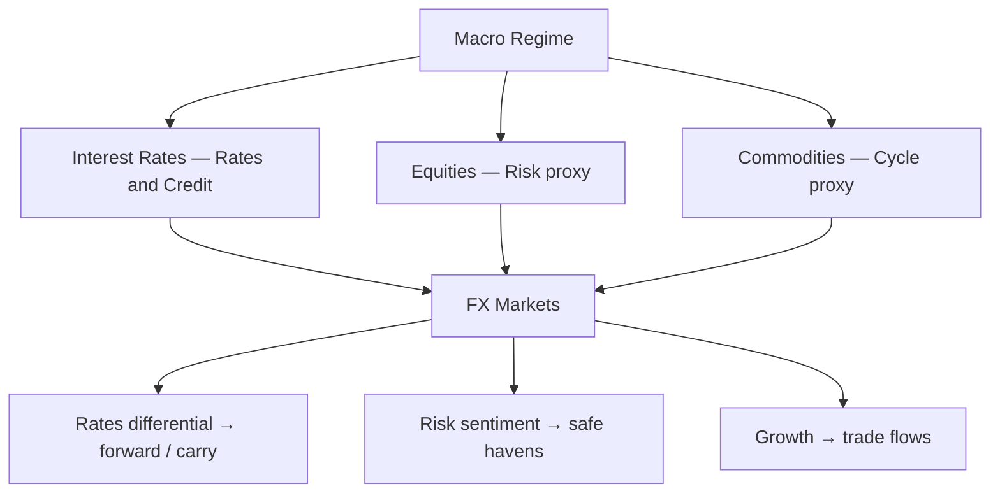
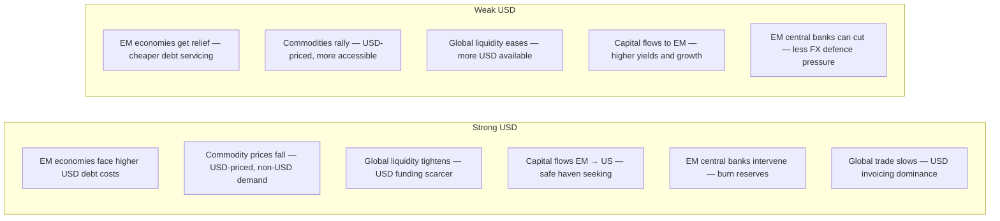

FX does not exist in isolation. Currency markets are deeply intertwined with **equities, fixed income, credit, and commodities** through capital flows, risk pricing, and economic linkages. Understanding these cross-asset relationships is essential for macro traders.

---

## The Cross-Asset Framework



---

## FX vs. Equities

### Risk-on/Risk-off Channel

The most direct link: when equities fall, risk-off safe havens (JPY, CHF) rally; when equities rise, high-beta currencies (AUD, NZD, EM) rise.

```
  S&P 500 vs. AUD/USD (typical positive correlation):
  S&P up 1%  → AUD/USD tends to rise (risk-on)
  S&P down 3% → AUD/USD tends to fall (risk-off)

  S&P 500 vs. USD/JPY:
  S&P up 1%  → USD/JPY tends to be flat or rise slightly
  S&P down 3% → USD/JPY tends to fall (JPY safe haven flows)

  2008 GFC correlation:
  S&P fell −57%  |  AUD/USD fell −37%  |  USD/JPY fell −20%
```

### Equity Flows and Currency Hedging

Equity flows create **currency demand** directly:
- When a European pension fund buys US equities → buys USD (supply EUR)
- When they hedge the position → buys EUR/USD forward (reduces USD demand)
- Hedge ratio changes can move FX markets: a 10% increase in hedge ratio on $1 trillion of assets = $100bn of currency demand

```
  Net hedging flow = (New allocation × hedge ratio change)
  For 10% hedge ratio increase on $1 trillion USD assets for EUR funds:
  = $100 billion of EUR/USD buying → significant spot and forward demand
```

---

## FX vs. Bonds

### The Rate Differential Channel

The most mechanical link: yield differentials drive forward rates (CIP) and attract/repel capital flows:

```
  US 2Y − Germany 2Y spread  vs.  EUR/USD
  ─────────────────────────────────────────
  When US rates rise relative to German rates:
  → USD becomes more attractive
  → Capital flows from EUR to USD
  → EUR/USD falls

  2022 example:
  US-Germany 2Y spread widened from 50bp → 300bp
  EUR/USD fell from 1.13 → 0.95 (-16%)
```

### The Safe Haven / Flight-to-Quality Channel

When equities fall, investors buy **government bonds** (UST, Bunds, JGBs) — this is the **equity-bond negative correlation** that has historically protected balanced portfolios:

```
  Typical correlation (risk-off):
  Equities DOWN → Bond prices UP (yields fall)
                → USD demand (UST denominated in USD)
                → JPY demand (JGB safe haven + carry unwind)

  BUT: This negative correlation can break down:
  2022: Both equities AND bonds sold off (inflation shock)
  → 60/40 portfolio failed
  → "Lost decade" correlation (stagflation-like)

  When does equity/bond correlation flip positive (both fall)?
  → Inflation shock: CBs must hike → bonds sell off + equities sell
  → 1970s, 2022 periods
  → Historically rare but devastating for balanced portfolios
```

---

## FX vs. Commodities

### Commodity Currency Correlations

```
  AUD/USD vs. Iron Ore & Copper:
  ┌──────────────────────────────────────────────────────────┐
  │ Iron ore  +50% (2020–2021)   → AUD/USD +20%             │
  │ Copper    +80% (2020–2021)   → AUD/USD +35%             │
  │ Iron ore  −60% (2021–2022)   → AUD/USD −15%             │
  └──────────────────────────────────────────────────────────┘

  CAD/USD vs. WTI Crude:
  ┌──────────────────────────────────────────────────────────┐
  │ Oil price 2016 crash: WTI $27/bbl   → USD/CAD at 1.46   │
  │ Oil recovery 2022:    WTI $120/bbl  → USD/CAD at 1.27   │
  │ Correlation (rolling 3M): typically 0.6–0.8              │
  └──────────────────────────────────────────────────────────┘

  NOK/EUR vs. Brent:
  → Norway ~14% of exports are oil/gas
  → EUR/NOK falls (NOK strengthens) when Brent rallies
  → 2022 Russia-Ukraine: EUR/NOK fell from 10.0 → 9.2 (NOK surged)
```

### The USD-Commodity Inverse Relationship

Commodities are priced in USD → **USD strengthens, commodity prices typically fall** (in USD terms):

```
  Mechanism:
  1. USD appreciation = commodities more expensive for non-USD buyers
     → demand falls → price falls
  2. USD appreciation = capital flows back to US from EM
     → EM growth slows → commodity demand falls

  2022 exception:
  USD surged AND oil surged (supply shock overrode the USD relationship)
  → Geopolitical supply shocks can temporarily break this correlation

  Longer-term (5Y+ rolling correlation):
  DXY vs. CRB (commodity index): ~−0.6 to −0.8
```

---

## FX vs. Credit

### Emerging Market FX and Credit Spreads

EM currencies and EM credit (dollar bonds) are highly correlated because both reflect **EM risk appetite**:

```
  EMBI spread (EM sovereign bond spread over UST) vs. EM FX:
  EMBI widens → EM FX sells off (correlated risk-off)
  EMBI tightens → EM FX rallies

  Country-specific: USD/BRL vs. Brazil CDS spread
  Brazil CDS widens (credit risk rises) → BRL weakens vs. USD
```

### G10 FX and Credit Spreads

In G10, **high yield credit spreads** are a risk barometer:

```
  HY credit widens → risk-off → AUD, NZD, EM weaken; JPY, CHF rally
  HY credit tightens → risk-on → AUD, NZD, EM rally; JPY, CHF weaken

  Relationship strongest during crisis periods (2008, 2020)
  Weaker during slow-moving economic shifts
```

---

## The USD as Global Risk Factor

The **USD Index (DXY)** is more than a currency — it is a **global risk barometer**:



---

## Cross-Asset Correlation Matrix (Typical Risk-Off)

```
         │ USD  JPY  CHF  AUD  EUR  Gold  Oil  Equities  EM FX
  ───────┼────────────────────────────────────────────────────
  USD    │  1    -    -    -    -    -     -      -        -
  JPY    │  ↓    1    +    -    0    +     -      -        -
  CHF    │  ↓    +    1    -    -    +     -      -        -
  AUD    │  ↓    -    -    1    +    -     +      +        +
  EUR    │  ↓    0    -    +    1    0     -      +        0
  Gold   │  ↓    +    +    -    0    1     0      -        -
  Oil    │  ↓    -    -    +    -    0     1      0        +
  Equities│ ↓    -    -    +    +    -     0      1        +
  EM FX  │  ↓    -    -    +    0    -     +      +        1

  Key: + = positive correlation, - = negative, 0 = neutral/mixed
  All during a typical risk-off environment
```

---

## Practical Cross-Asset Trade Examples

### 1. Global Reflation Trade (2020–2021)

```
  Trigger: Central bank QE + fiscal stimulus post-COVID
  → Buy AUD/USD (growth currency, commodity levered)
  → Buy EM equities / currencies
  → Sell USD (risk-on + Fed dovish)
  → Buy copper (China reopening)
  → Sell 10Y UST (inflation expectations rising)

  All legs tied to same macro thesis
```

### 2. Dollar Wrecking Ball (2022)

```
  Trigger: Fed aggressive hiking cycle (fastest in 40 years)
  → Long USD across the board (DXY to ~114)
  → Short EUR/USD (ECB lagging, energy crisis)
  → Short USD/JPY (buying USD/JPY — BoJ stuck)
  → Short EM FX
  → Short gold (rising real rates → gold headwind)
  → Long oil (supply shock from Russia — offsetting currency move)
  → Short equities (risk-off + rates rising)
```

### 3. BoJ Carry Unwind (2024)

```
  Trigger: BoJ first rate hike in 17 years + carry unwind
  → Short USD/JPY (buy JPY)
  → Short AUD/JPY, NZD/JPY, EUR/JPY (carry unwind)
  → Short US equities (correlated sell-off)
  → Long gold (flight to safety)
  → VIX spike (equity vol bought)
```

---

## Cross-Asset Indicators Dashboard

```
  MACRO ENVIRONMENT INDICATORS:
  ┌────────────────────────────────────────────────────────────┐
  │ Indicator              | Risk-On      | Risk-Off           │
  │ ───────────────────────┼──────────────┼────────────────── │
  │ VIX                    | <15, falling | >25, rising        │
  │ DXY (USD index)        | Falling      | Rising             │
  │ USD/JPY                | Rising       | Falling            │
  │ AUD/JPY                | Rising       | Falling (best RoRo)│
  │ US 10Y yield           | Rising       | Falling (flight)   │
  │ US 2Y10Y spread        | Steepening   | Flattening/inverted│
  │ US HY Credit spread    | Tightening   | Widening           │
  │ EMBI spread            | Tightening   | Widening           │
  │ Gold                   | Sideways     | Rising             │
  │ Oil                    | Rising       | Falling (demand)   │
  │ Copper                 | Rising       | Falling            │
  └────────────────────────────────────────────────────────────┘
```

---

## Further Reading

- Macrosynergy: *Macro Trading Factors* — [macrosynergy.com](https://macrosynergy.com/academy/examples-macro-trading-factors/)
- *Global Macro Trading* — Greg Gliner (Bloomberg Press, 2014)
- *Intermarket Analysis* — John J. Murphy (Wiley, 2004) — classic cross-asset framework
- *The Art of Currency Trading* — Brent Donnelly (Wiley, 2019)
- NBER: *Deviations from Covered Interest Parity* — [nber.org](https://www.nber.org/system/files/working_papers/w23170/w23170.pdf)
