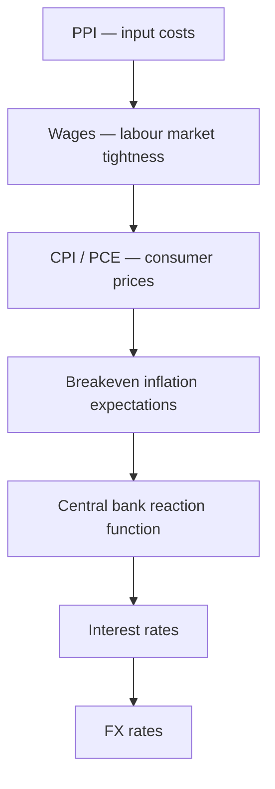

**Inflation** is the rate at which the general price level rises, eroding purchasing power. Central banks exist primarily to manage it — their responses to inflation are the most powerful macro driver of FX markets over 6–24 month horizons.

---

## Inflation Measures

Different inflation gauges capture different parts of the price level. FX traders watch all of them:

| Measure | What It Captures | Key Release (US) |
|---|---|---|
| **CPI (Headline)** | All consumer prices including food & energy | Monthly (BLS) |
| **Core CPI** | CPI excluding food & energy (less volatile) | Monthly |
| **PCE (Personal Consumption Expenditure)** | Fed's preferred measure; broader basket | Monthly (BEA) |
| **Core PCE** | PCE ex food & energy | Monthly — **most important for Fed** |
| **PPI** | Producer/wholesale prices (leading indicator of CPI) | Monthly |
| **Wage Growth / Average Hourly Earnings** | Labour cost inflation; sticky component | Monthly (with NFP) |
| **Breakeven Inflation** | Market-implied inflation (TIPS spreads) | Real-time via bond market |



---

## The Central Bank Reaction Function

Central banks set policy based on their **mandate**:

| Central Bank | Mandate | Key Rate |
|---|---|---|
| **Federal Reserve (Fed)** | Dual mandate: price stability (2% PCE) + maximum employment | Fed Funds Rate |
| **European Central Bank (ECB)** | Single mandate: price stability (2% HICP) | Deposit Facility Rate |
| **Bank of England (BoE)** | Inflation target: 2% CPI | Bank Rate |
| **Bank of Japan (BoJ)** | Price stability: ~2% CPI | Policy Balance Rate (previously YCC) |
| **Swiss National Bank (SNB)** | Price stability + exchange rate monitoring | SNB Policy Rate |
| **Reserve Bank of Australia (RBA)** | 2–3% CPI target band | Cash Rate |
| **PBOC** | Multiple: growth, inflation, FX stability | LPR (Loan Prime Rate) |

### Taylor Rule: A Framework for Rate Decisions

$$\text{Rate} = r^* + \pi + \alpha(\pi - \pi^*) + \beta(y - y^*)$$

Where:
- $r^*$ = Neutral real interest rate (~2%)
- $\pi$ = Actual inflation
- $\pi^*$ = Inflation target (2%)
- $y$ = Actual GDP / output
- $y^*$ = Potential GDP
- $\alpha$ = Weight on inflation gap (typically 0.5)
- $\beta$ = Weight on output gap (typically 0.5)

Given: $r^* = 0.5\%$, $\pi = 8.0\%$ (CPI), $\pi^* = 2.0\%$, $(y - y^*) = +2\%$ (very tight labour market)

$$
\begin{align}
\text{Rate} &= r^* + \pi + 0.5 \times (\pi - \pi^*) + 0.5 \times (y - y^*) \\[6pt]
  &= 0.5 + 8.0 + 0.5 \times (8.0 - 2.0) + 0.5 \times 2.0 \\[6pt]
  &= 0.5 + 8.0 + 3.0 + 1.0 \\[6pt]
  &= \mathbf{12.5\%}
\end{align}
$$

Actual Fed Funds peaked at 5.25% → the Fed was BEHIND the curve (which is why USD still rallied — market knew tightening was coming).

---

## Hawkish vs. Dovish Policy and FX Impact

```
  ┌──────────────────────────────────────────────────────────────┐
  │                    HAWKISH                                   │
  │  → Rate hikes (or signalling hikes)                          │
  │  → Reducing balance sheet (QT)                               │
  │  → Concerned about inflation, willing to accept slower growth│
  │  → FX impact: currency STRENGTHENS (higher yield, tighter)   │
  └──────────────────────────────────────────────────────────────┘

  ┌──────────────────────────────────────────────────────────────┐
  │                    DOVISH                                    │
  │  → Rate cuts (or signalling cuts)                            │
  │  → Expanding balance sheet (QE)                              │
  │  → Concerned about growth/employment, soft on inflation      │
  │  → FX impact: currency WEAKENS (lower yield, easier policy)  │
  └──────────────────────────────────────────────────────────────┘
```

### The "Hawkish Cut" and "Dovish Hike"

```
  Market pricing is RELATIVE and FORWARD-LOOKING:

  Hawkish cut: CB cuts by less than expected (e.g. 25bp vs. 50bp priced)
  → Currency can RALLY on a cut (less easing than feared)

  Dovish hike: CB hikes but signals pause / concern about growth
  → Currency can FALL on a hike (less tightening ahead than expected)

  Key lesson: The SURPRISE relative to expectations drives the move,
  not the absolute policy action.
```

---

## Inflation Regimes and Currency Behaviour

### High Inflation (Above Target)

```
  Phase 1 — Inflation rising, CB behind curve:
  → CB slow to hike → real rates deeply negative
  → Currency WEAKENS (negative real rates = unattractive)
  → Bond market sells off (yields rise independently)
  → Gold, commodities rally

  Phase 2 — CB hikes aggressively to catch up:
  → Rate hike EXPECTATIONS drive currency STRONGER
  → 2022 USD: Fed hiked 525bps → USD rallied 15%+ (DXY ~114)

  Phase 3 — Inflation peaks, disinflation:
  → Market prices CUTS ahead
  → Currency weakens in anticipation of easing
  → 2023 EUR: ECB still hiking but market looked through to cuts
```

### Low / Negative Inflation (Deflation Risk)

```
  → CB cuts to stimulate; real rates can be positive despite low nominals
  → JPY 1990s–2020s: persistent deflation
    → BoJ ZIRP then NIRP → JPY was funding currency for carry trades
    → But: JPY still strengthened in risk-off (safe haven inflows)

  Deflation trap logic:
  Consumers delay purchases (things will be cheaper tomorrow)
  → Demand falls further → growth slows → more deflation
  → CB lowers rates but policy transmission weak
  → Classical liquidity trap
```

---

## Quantitative Easing (QE) and FX

**QE** (large-scale asset purchases by the CB) typically weakens the currency:

```
  QE mechanics:
  CB creates new money → buys government bonds (or MBS)
  → Bond prices rise, yields fall
  → Investors reach for yield in riskier / foreign assets
  → Capital outflows → domestic currency weakens
  → Also: direct signal of looser monetary policy

  QE examples:
  Fed QE1 (2009):    USD weakened broadly
  ECB QE (2015):     EUR/USD fell from 1.20 → 1.05
  BoJ QQE (2013):    USD/JPY rose from 93 → 125
  BoJ YCC (2016):    JPY kept cheap; carry trade funded in JPY
```

### QT (Quantitative Tightening)

```
  QT = CB reduces balance sheet (lets bonds mature, sells holdings)
  → Tightens financial conditions → yields rise
  → Typically positive for currency (tighter policy)
  → Reduces USD liquidity globally → USD-positive
```

---

## Yield Curve Control (YCC) — Bank of Japan Case Study

**YCC** is an extreme form of monetary policy where the CB pins yields at a specified target across the curve:

```
  BoJ YCC Policy (2016–2023):
  → Target: 10Y JGB yield ≤ 0.25% (later ±0.50%, then ±1.0%)
  → BoJ buys unlimited JGBs to enforce the cap
  → Result: Japan 10Y yield pinned near zero
             US 10Y yield rose to 4–5%
             US-Japan spread: 400–500bps
             → USD/JPY surged to 32-year highs (>150)

  The "currency blowup" risk:
  → BoJ could not control JPY without also abandoning YCC
  → Two targets, one instrument (interest rates can only be set at one level)
  → This is the classic Mundell-Fleming trilemma in action:
     Cannot simultaneously have: fixed exchange rate + free capital + independent monetary policy

  BoJ capitulation (2024):
  → Abandons YCC → hikes rates (first in 17 years)
  → Yen carry trade unwinds → USD/JPY crashes from 160 → 140
```

---

## Key Inflation Indicators by Country

### United States
```
  Monthly calendar:
  Week 1: ISM Manufacturing / Services PMI (Wed/Fri)
  Week 2: CPI (typically Tuesday)
  Week 3: Fed decision (8x per year) / FOMC minutes
  Week 4: PCE / ECI (quarterly) / GDP (quarterly)

  Most market-moving: Core PCE, CPI, NFP, FOMC decision + press conf.
```

### Eurozone
```
  Key releases:
  Flash HICP (monthly, end of month): headline inflation
  ECB decision (every 6 weeks)
  Eurozone PMI flash (monthly): activity signal
  German IFO / ZEW: business confidence

  Particular complexity: ECB must manage 20 countries with one rate
  → "One size fits none" problem (divergent fiscal positions)
```

### Japan
```
  Key releases:
  Japan CPI (monthly): trending higher since 2022
  BoJ decision: quarterly + surprise interventions
  Tankan survey (quarterly): business conditions
  Tokyo CPI (monthly, precedes national): leading indicator

  Key dynamic: Japan has structural deflation history;
  CB credibility requires proof that inflation is self-sustaining
  before it tightens significantly
```

---

## Purchasing Power Parity (PPP)

**PPP** is a long-run FX theory stating that exchange rates adjust to equalise the price of identical goods across countries:

$$S = \frac{P_{\text{domestic}}}{P_{\text{foreign}}}$$

```
  If US prices double while Eurozone prices stay flat:
  → PPP implies EUR/USD should rise (USD must weaken)
  → USD has less purchasing power

  Big Mac Index (The Economist): lighthearted PPP measure
  → Compares price of a Big Mac in USD across countries
  → Shows whether currencies are over/undervalued vs. USD

  PPP works SLOWLY (years to decades)
  → Not useful for short/medium-term trading
  → But useful for identifying extreme over/undervaluation
```

---

## Further Reading

- *The Federal Reserve and the Financial Crisis* — Ben Bernanke (Princeton, 2013)
- *21st Century Monetary Policy* — Ben Bernanke (W.W. Norton, 2022)
- BIS Working Papers on inflation and exchange rates — [bis.org](https://www.bis.org)
- MTFX: *How Macro Trends Drive Currency Volatility* — [mtfxgroup.com](https://www.mtfxgroup.com/post/from-interest-rates-to-trade-wars-how-macro-trends-drive-currency-market-volatility/)
- *Manias, Panics, and Crashes* — Charles P. Kindleberger (Wiley, 7th ed.)
