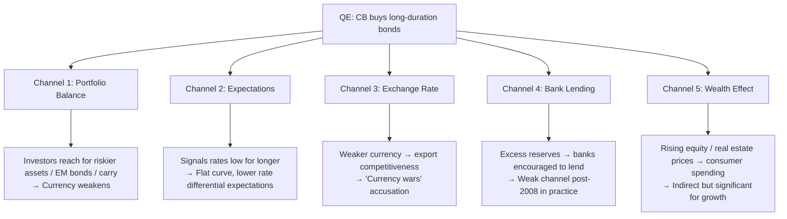

Modern monetary policy analysis goes far beyond watching rate decisions. Understanding the **theoretical frameworks** central banks use — the Taylor Rule, the neutral rate R*, and the management of policy at the zero lower bound — is essential for anticipating how policy will evolve and how markets will respond.

---

## The Taylor Rule

Proposed by economist John Taylor (1993), the **Taylor Rule** is a prescriptive formula for setting the short-term policy rate based on observable macroeconomic conditions:

$$i^* = r^* + \pi + 0.5 \times (\pi - \pi^*) + 0.5 \times (y - y^*)$$

Where:
- $i^*$ = recommended (target) nominal policy rate
- $r^*$ = neutral real interest rate ("R-star")
- $\pi$ = actual inflation (typically last 12 months)
- $\pi^*$ = inflation target (usually 2%)
- $y$ = actual output (GDP)
- $y^*$ = potential output (trend GDP)
- $(y - y^*)$ = output gap (positive = economy running hot)

> Reference: Taylor, J.B. (1993). *Discretion versus Policy Rules in Practice.* Carnegie-Rochester Conference Series on Public Policy, 39, 195–214.

### Reading the Formula

```
  The rule has three components:

  1. r* + π  = "neutral nominal rate"
     → The rate appropriate when economy is at target on both fronts
     → e.g., r* = 0.5%, π* = 2% → neutral nominal = 2.5%

  2. + 0.5 × (π − π*)  = "inflation gap response"
     → For every 1% inflation is above target, raise rate by 0.5%
     → Taylor principle: the REAL rate must rise when inflation rises
       → coefficient > 0.5 ensures real rates increase → stabilising

  3. + 0.5 × (y − y*)  = "output gap response"
     → For every 1% the economy runs above potential, raise rate 0.5%
     → Prevents overheating when growth is strong
```

### 2022 US Calibration: Fed Behind the Curve

Given: $r^* = 0.5\%$ (Laubach-Williams estimate), $\pi = 8.5\%$ (CPI), $\pi^* = 2.0\%$, output gap $\approx +2\%$ (tight labour market)

$$
\begin{align}
i^* &= r^* + \pi + 0.5 \times (\pi - \pi^*) + 0.5 \times (y - y^*) \\[6pt]
  &= 0.5 + 8.5 + 0.5 \times (8.5 - 2.0) + 0.5 \times 2.0 \\[6pt]
  &= 0.5 + 8.5 + 3.25 + 1.0 \\[6pt]
  &= \mathbf{13.25\%}
\end{align}
$$

Actual Fed Funds rate (mid-2022): 1.75%–2.00%

- The Fed was roughly 11 percentage points BELOW the Taylor rule
- This quantified "how far behind the curve" the Fed was
- Explains why markets priced very aggressive hiking ahead
- USD surged as the market anticipated rapid catch-up hikes

### Modified Taylor Rules

Different weights produce different prescriptions:

**Balanced approach (Fed preferred):**

$$i^* = r^* + \pi + 1.0 \times (\pi - \pi^*) + 1.0 \times (y - y^*)$$

**Inflation-focused (Volcker style):**

$$i^* = r^* + \pi + 1.5 \times (\pi - \pi^*) + 0.5 \times (y - y^*)$$

**Employment-focused:**

$$i^* = r^* + \pi + 0.5 \times (\pi - \pi^*) + 1.5 \times (y - y^*)$$

```
  The Fed's "Balanced Approach Shortfalls" rule (post-2020):
  → Uses shortfalls from maximum employment, not symmetric gaps
  → More tolerant of labor market strength; more aggressive on weakness
  → Introduced via new framework in August 2020 (AIT: Average
    Inflation Targeting)
```

---

## R-Star: The Neutral Rate of Interest

**R-star (r\*)** is the real interest rate consistent with the economy operating at full employment and inflation at target — neither stimulative nor restrictive. It is the "Goldilocks" rate.

```
  r* = the equilibrium real short-term interest rate when:
  → Output = Potential output (no output gap)
  → Inflation = Target (π = π*)
  → No supply or demand shocks
```

$$\text{Nominal neutral rate} = r^* + \pi^* \approx 0.5\% + 2\% = 2.5\%$$

```
  Policy stance:
  Fed Funds > r* + π → Restrictive policy (slowing economy)
  Fed Funds < r* + π → Accommodative policy (stimulating)
  Fed Funds = r* + π → Neutral policy
```

### The Decline of R-Star (Secular Stagnation)

```
  US Laubach-Williams estimate of r* (NY Fed model):

  1960s–1970s: r* ≈ 4–5% (strong growth, high population growth)
  1980s–1990s: r* ≈ 2–3% (post-Volcker stabilisation)
  2000s:        r* ≈ 2%
  2010s:        r* ≈ 0–0.5% (secular stagnation)
  2020–2022:    r* ≈ 0.5–1.0%  (uncertainty around post-COVID level)

  Structural drivers of declining r*:
  ┌──────────────────────────────────────────────────────────┐
  │ 1. Demographics: Aging population → more saving → excess  │
  │    capital supply → lower real return on capital          │
  │ 2. Productivity slowdown: Lower investment demand          │
  │ 3. Global savings glut: China, Germany CA surpluses →     │
  │    global capital seeking safe assets → lower yields      │
  │ 4. Rising inequality: Top earners save more → excess      │
  │    savings → downward pressure on real rates              │
  │ 5. Falling capital goods prices: IT/tech investment        │
  │    requires less physical capital expenditure             │
  └──────────────────────────────────────────────────────────┘
```

### Why R-Star Matters for FX

```
  If r* has structurally risen post-COVID (technology, fiscal, etc.):
  → Terminal Fed Funds rate higher than 2015–2019 cycle
  → USD structurally more supported
  → Carry trades against low r* currencies (JPY, EUR) more attractive

  If r* remains low (secular stagnation returns):
  → Fed can only hike to 2–3% before over-tightening
  → Duration assets (bonds) more attractive
  → Equities and risky assets re-rate higher at lower discount rates
```

---

## The Zero Lower Bound (ZLB) and Shadow Rates

When the policy rate approaches zero, the central bank reaches the **Zero Lower Bound (ZLB)** — it cannot cut rates below (approximately) 0% in a conventional sense (though negative rates have been tried in Japan, ECB, SNB).

### The ZLB Problem

```
  Normal monetary policy transmission:
  CB cuts rate → borrowing costs fall → investment rises → GDP up

  At ZLB (rate = 0%):
  → Cannot cut further → conventional tool exhausted
  → "Liquidity trap": monetary policy becomes ineffective?
  → Deflationary spiral risk: falling prices → delay purchases
    → demand falls further → more deflation

  ZLB experiences:
  Japan: 1999–2006 (ZIRP), 2010–present (near zero or negative)
  US:    2008–2015 (ZLB), 2020–2022 (ZLB again)
  Euro:  2014–2022 (near/below zero — negative deposit rate)
```

### Shadow Rate Models

**Shadow rates** attempt to measure the **true stance of monetary policy** even when the nominal rate is pinned at zero — incorporating the effect of QE on the effective policy stance:

```
  Shadow rate concept:
  If QE pushes down the 10Y yield equivalent to −3% short rate,
  the shadow rate might be −3% even though the nominal rate is 0%

  Krippner (2013) and Wu-Xia (2016) frameworks:
  Shadow rate = notional short rate that would produce the same
                yield curve as the combination of:
                (a) zero short rates + (b) QE effects on duration

  Interpretation:
  Wu-Xia shadow rate (US):
  → 2013: −3% (peak QE, deeply stimulative despite 0% nominal)
  → 2015: −1% (tapering; less stimulus)
  → 2018: +2.5% (normalisation; above neutral)
  → 2021: −4% (peak COVID stimulus: 0% rates + massive QE)

  Why shadow rates matter:
  → Better captures the actual tightening/easing cycle
  → More informative for FX carry analysis than nominal rates
    (compare USD shadow rate to EUR/JPY shadow rates)
```

---

## Quantitative Easing (QE): Transmission Channels

QE is effective through multiple channels, each with FX implications:



---

## Forward Guidance: The Expectations Weapon

**Forward guidance** is the CB's explicit communication about the future path of rates — itself a policy tool that shapes current financial conditions:

```
  Types of forward guidance:
  ─────────────────────────────────────────────────────────
  Time-based: "Rates will remain at this level for at least 2 years"
  → Clear commitment; anchors short end of yield curve
  → Risk: becomes incredible if conditions change

  State-based: "Rates will remain low until unemployment < 6.5%"
  → More flexible; adjusts to economic outcomes
  → FOMC 2012–2014: unemployment threshold guidance

  Qualitative: "Rates will remain accommodative for some time"
  → Maximum flexibility; minimum credibility/commitment
  → Most common in normal times

  FX market reading of forward guidance:
  → "Data-dependent" = more volatility (market prices uncertainty)
  → Concrete thresholds = anchored expectations = lower vol
  → Credible forward guidance flattens the short end of the yield curve
```

---

## Further Reading

- Taylor, J.B. (1993). *Discretion versus Policy Rules in Practice.* Carnegie-Rochester Conference.
- NY Fed: *Laubach-Williams r* estimates* — [newyorkfed.org/research/policy_indicators/rstar](https://www.newyorkfed.org/research/policy_indicators/rstar)
- Wu, J.C. & Xia, F.D. (2016). *Measuring the Macroeconomic Impact of Monetary Policy at the Zero Lower Bound.* Journal of Money, Credit and Banking.
- Bernanke, B. (2022). *21st Century Monetary Policy.* W.W. Norton.
- *The Courage to Act* — Ben Bernanke (W.W. Norton, 2015) — first-hand account of ZLB policy
