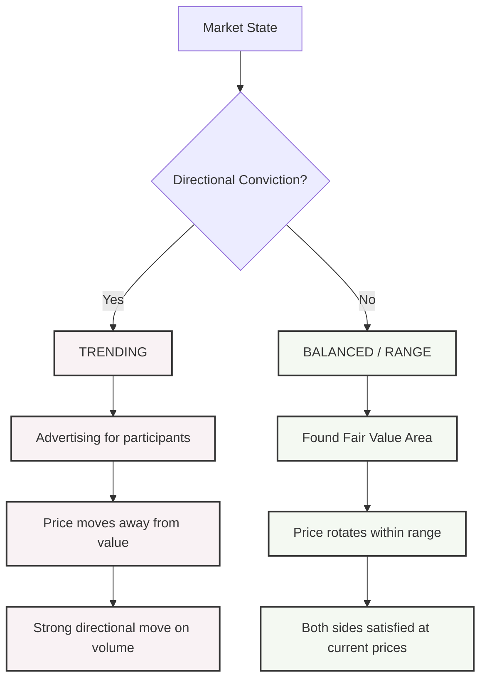

**Auction Market Theory (AMT)** is a framework for understanding price behavior based on how markets facilitate trade — how buyers and sellers discover the price that balances supply and demand through a continuous auction process.

---

## The Auction Market Framework

### Price as a Facilitating Mechanism



### The Auction Process

```
  Two-sided auction:
  → BUYERS initiate an upward auction: price rises until sellers appear
  → SELLERS initiate a downward auction: price falls until buyers appear

  Market balance restored when:
  → Both sides feel the price is "fair" (trade is facilitated)
  → Volume picks up at the new price (traders accept the new value)

  Imbalance signals:
  → Buyers dominant: price makes higher lows; selling dries up
  → Sellers dominant: price makes lower highs; buying dries up
  → ONE-TIME FRAMES: single TPOs at extreme → market rejected that price
```

---

## Market Profile: The Tool

**Market Profile** was developed by **J. Peter Steidlmayer** in 1984 at the Chicago Board of Trade. It organizes price and time data into a frequency distribution to reveal market structure.

> Reference: Steidlmayer, J.P. & Koy, S. (1986). *Markets and Market Logic.* Porcupine Press.

### Time-Price Opportunity (TPO)

```
  A TPO = one letter representing one 30-minute period
  at a particular price

  Traditional assignment:
  Period 1 (9:30–10:00 AM):   A
  Period 2 (10:00–10:30 AM):  B
  Period 3 (10:30–11:00 AM):  C
  ... and so on

  A completed Market Profile day looks like:
  (Each row = one price level; each letter = TPO at that price)

  Price
  $4260  D
  $4255  CD
  $4250  BCD
  $4245  ABCDE         ← Value Area High
  $4240  ABCDEFG       ← Point of Control (most TPOs)
  $4235  ABCDEFG
  $4230  BCDEFG        ← Value Area Low
  $4225  CDEF
  $4220  DE
  $4215  E

  Reading: Price spent MOST time between $4230–$4245 (Value Area)
           → This is where the market found "fair value" today
```

### Value Area and Point of Control

```
  POINT OF CONTROL (POC):
  → The price level with the MOST TPOs (most time spent)
  → Represents the most accepted price during the session
  → Strongest equilibrium point; market's "fair price"

  VALUE AREA (VA):
  → The price range containing 70% of all volume/TPOs
  → Standard method: start at POC, expand to include 70%
  → Value Area High (VAH) = upper boundary
  → Value Area Low (VAL) = lower boundary

  Why 70%?
  → Bell curve: one standard deviation = ~68% (≈ 70%)
  → The Value Area approximates ±1σ of price activity
  → Standard statistical distribution of a balanced market

  INITIAL BALANCE (IB):
  → Range established in the first 2 periods (first hour)
  → Sets the tone for the day
  → The market's opening "hypothesis" about fair value
  → Extension beyond IB = directional conviction
```

---

## Market Profile Day Types

Steidlmayer identified distinct structural patterns:

```
  1. NORMAL DAY:
  → Thin initial balance
  → Range extends significantly beyond IB in both directions
  → Bell-curve shaped profile
  → Other timeframe traders enter throughout the day
  → Signals: transition; neither buyers nor sellers dominant

  2. NORMAL VARIATION OF A NORMAL DAY:
  → Average IB; range extends beyond on ONE side only
  → Classic: IB + one-sided extension (buyers OR sellers take control)
  → Most common day type

  3. TREND DAY:
  → Very thin initial balance
  → Range extends dramatically in ONE direction
  → Profile is elongated; little time at any price (single TPOs)
  → Each period's range barely overlaps the prior period
  → Signals: STRONG directional conviction; other timeframe IMBALANCE
  → High volume, directional close (at the extremes)

  4. DOUBLE-DISTRIBUTION DAY:
  → Market trades in one range, then breaks to another range
  → Creates two distinct "bells" at different price levels
  → Gap between distributions = poorly accepted prices
  → Signals: trend day that found acceptance at new level

  5. NEUTRAL DAY:
  → Symmetric extensions above and below IB
  → Neither buyer nor seller wins the day
  → Profile is wide and even
  → Signals: truly balanced market; continuation likely
```

---

## Composites and Multi-Day Analysis

```
  Single-day Market Profile shows intraday structure.
  COMPOSITE profiles show structure over multiple days/weeks.

  Composite Value Area (multiple days):
  → The price range accepted by BOTH short-term and long-term
    participants
  → Defines "DEVELOPING VALUE" — where the market consensus lives

  High Volume Nodes (HVN):
  → Price levels with very HIGH accumulated TPO/volume
  → Represent STRONG acceptance; price will slow/stop at these
  → "Magnets" that attract price when revisited
  → Support/resistance with a structural reason

  Low Volume Nodes (LVN):
  → Price levels with very LOW accumulated volume/TPOs
  → Market moved through quickly; little agreement at these prices
  → "Air pockets" — price travels FAST through LVNs
  → Often appear at breakout points, gaps, trend day extremes

  Example (WTI Crude):
  If $75–77/bbl is an HVN from 3 months of prior activity:
  → Approaching $75 from below: expect congestion, potential reversal
  → Approaching $75 from above: expect support (buyers remember value)
  → Breakthrough of $75 on high volume: HVN becomes LVN (breakout)
```

---

## Initiative vs. Responsive Activity

AMT defines two types of trader behavior that determine the direction of trade:

```
  INITIATIVE ACTIVITY:
  → Traders acting OUTSIDE the Value Area
  → Initiating NEW positions above VAH or below VAL
  → "Probing" for new value at unexplored prices
  → Signs: price makes new highs/lows with VOLUME
  → Implication: market may be establishing new Value Area

  RESPONSIVE ACTIVITY:
  → Traders responding to PERCEIVED MISPRICING
  → Buying below VAL (value too cheap) or selling above VAH
    (value too expensive)
  → Fading the move back toward value
  → Signs: price extends beyond VA but quickly returns; low volume
  → Implication: current value area is being defended

  Trading application:
  ─────────────────────────────────────────────────────────
  Responsive sell: Price exceeds VAH; low volume above → SELL
  Responsive buy:  Price falls below VAL; low volume below → BUY
  Initiative buy:  Price breaks above VAH; HIGH volume + acceptance → BUY
  Initiative sell: Price breaks below VAL; HIGH volume + acceptance → SELL
```

---

## Market Profile in Practice: FX and Futures

```
  Market Profile works across any liquid market:

  EQUITY INDEX FUTURES (S&P 500 ES, NQ):
  → Most developed MP literature; CME's original use case
  → Daily profiles reference prior day's VA for gap trade setups
  → "Open within VA": expect rotation
  → "Open outside VA": expect trending or responsive behavior

  FX (EURUSD, spot/futures):
  → 24-hour market: use session-based profiles (London, NY)
  → Asian session often sets overnight VA
  → London open: tests Asian session VA → responsive or initiative?
  → NY open: tests London VA

  COMMODITIES (Crude, Gold, Corn):
  → Market Profile aligns well with seasonal supply/demand turning points
  → Open interest changes confirm shifts in other timeframe activity

  PRACTICAL LEVELS FROM MARKET PROFILE:
  ─────────────────────────────────────────────────────────
  POC (prior day/week): Strongest equilibrium; treat as magnet
  VAH (prior day/week): Resistance if price approaches from below
  VAL (prior day/week): Support if price approaches from above
  HVN (multi-week):     Strong support/resistance with depth
  LVN (multi-week):     Expect fast moves; little friction
  ─────────────────────────────────────────────────────────
```

---

## Further Reading

- Steidlmayer, J.P. & Koy, S. (1986). *Markets and Market Logic.* Porcupine Press.
- Dalton, J., Jones, E., & Dalton, R. (1990). *Mind Over Markets.* Probus Publishing.
- Dalton, J. (2013). *Markets in Profile.* Wiley Trading.
- CBOT: *Market Profile* (original educational materials, 1984)
- *The Market Profile Practitioner* — Gareth Hagger, available via CME Institute
