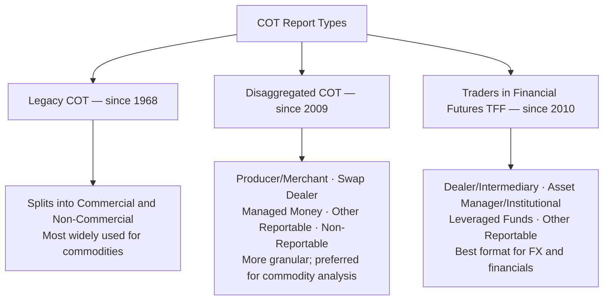
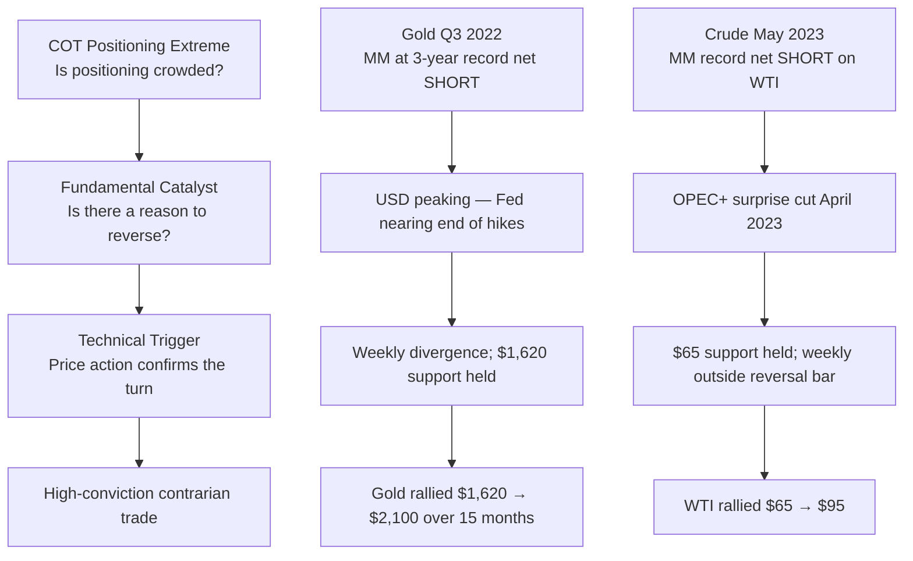

The **Commitments of Traders (COT)** report is one of the most powerful publicly available datasets for understanding who holds what positions in US futures markets — and what it implies for future price direction.

---

## COT Report: Overview

### What It Is

CFTC requires all traders above a reporting threshold to disclose positions. Published weekly (every Friday; reflects Tuesday positions). Covers futures and options on US-regulated exchanges (CME, NYMEX, CBOT, ICE US, CBOE) for commodities, FX, interest rates, and equity indices.



### Reporting Categories (Legacy COT)

```
  COMMERCIAL TRADERS:
  → Use futures to HEDGE their underlying physical business
  → Oil company hedging production (short crude futures)
  → Airline hedging jet fuel purchases (long crude/products)
  → Farmer hedging harvest (short corn/wheat/soy)
  → Goldman Sachs commodity index roll (systematic long)
  → CFTC definition: files a Form 40 declaring commercial hedging
  → Key characteristic: INFORMED about supply/demand fundamentals
    → Often net SHORT in commodities (hedging production)

  NON-COMMERCIAL TRADERS (Large Speculators):
  → Speculate for profit; no underlying physical business
  → Hedge funds, commodity trading advisors (CTAs), trend followers
  → Typically LONG in bull markets; SHORT in bear markets
  → Reporting threshold: CME sets position limits per market

  NON-REPORTABLE (Small Speculators):
  → Below reporting threshold
  → Retail traders, small funds
  → Often the weakest hands; late to trends; useful contrarian signal
```

---

## The Disaggregated Report: More Useful Breakdown

For commodities, the **Disaggregated COT** provides sharper intelligence:

```
  PRODUCER/MERCHANT/PROCESSOR/USER:
  → Physical commodity hedgers: producers, merchants, processors
  → Most informed category about physical supply/demand
  → Typically SHORT in commodity bull markets (hedging future production)
  → When they START COVERING shorts (reducing net short): BULLISH signal
  → When they ADD to shorts aggressively: production profitable → BEARISH

  SWAP DEALER:
  → Banks and dealers managing OTC swap books
  → Often the "other side" of index fund exposure
  → Commodity index flows show up here (Goldman Sachs, Bloomberg indices)
  → Less useful for directional signals; largely passive

  MANAGED MONEY (the key speculative category):
  → Commodity trading advisors (CTAs), hedge funds, managed accounts
  → Systematic trend followers dominate this category
  → Key positioning signal: record net long or net short = EXTREME
  → When Managed Money is at NET LONG EXTREME: market is crowded long
    → Vulnerable to sharp reversal if trend fails
  → When at NET SHORT EXTREME: positioning tailwind for rally
    → Forced short covering can amplify upside

  OTHER REPORTABLE:
  → Smaller funds, high-net-worth individuals above threshold
  → Mixed signal; background noise in most analyses
```

---

## COT as a Contrarian Indicator

The most powerful application of COT data is as a **contrarian/positioning extreme signal**:

```
  KEY PRINCIPLE:
  When a specific trader category is at a HISTORICAL EXTREME in
  net positioning, the probability of a MEAN REVERSION increases.

  Why extremes matter:
  → Large spec net long extreme = "everyone who wants to buy has bought"
  → No new buyers available → price stalls or reverses
  → Triggered by: disappointing data, technical breakdown → MASS SELLING
  → Forced liquidation (margin calls) amplifies the move

  HOW TO APPLY COT:
  1. Normalize net positions:
```

$$\text{Net position index} = \frac{\text{Current} - \text{Min}}{\text{Max} - \text{Min}} \times 100$$

```
     → 0 = maximum historical net short
     → 100 = maximum historical net long

  2. Identify extremes (>80 or <20 typically):
     → >80: crowded long → watch for reversal catalyst
     → <20: crowded short → watch for short covering rally

  3. Look for TREND CHANGE confirmation (don't fade trend alone):
     → COT extreme + price reversal candle (weekly chart)
     → COT extreme + technical breakdown of support
     → COT extreme + fundamental catalyst (supply shock, CB decision)
```

### Classic COT Setups

```
  CRUDE OIL (long-held examples):
  → When Managed Money net longs hit record (2018, 2022):
    market subsequently reversed on demand concerns
  → When Producer shorts hit maximum (hedging locked in):
    price often near a cycle TOP (producers are bearish on own product)
  → When Managed Money at record shorts: short-covering rallies historically
    strong (May 2023: MM net short record → oil rallied 20%)

  GOLD:
  → Managed Money near net short: historically strong BUY signal
    (2018 Q3, 2022 Q3: both were near-perfect long entries)
  → At record net longs: caution (2020 peak; 2023 before pullback)
  → Commercials: ALWAYS net short (gold miners/producers hedge output)
    → But RATE of change in commercial short matters:
      If they reduce shorts → more bullish signal

  FX (TFF Report — Leveraged Funds category):
  → JPY: Large speculative SHORT in JPY = crowded short
    → 2022–2023: record leveraged fund short JPY
    → August 2024: violent short squeeze as BoJ hiked rates
  → EUR: Record spec short EUR historically at cycle lows
  → Record spec LONG USD: often near USD peaks

  CORN / SOYBEANS:
  → Managed Money at max short corn: reliable buy signal pre-planting
  → But: record longs heading into harvest = risky (supply increase)
```

---

## Open Interest Analysis

**Open interest (OI)** is the total number of outstanding futures contracts not yet settled:

```
  OPEN INTEREST CHANGE INTERPRETATION:

  Price UP + OI UP:
  → NEW money entering market on the LONG SIDE
  → Trend is STRONG; confirmation of uptrend
  → "Strong hands" buying → bullish continuation

  Price DOWN + OI UP:
  → NEW money entering market on the SHORT SIDE
  → Strong downtrend; bears adding new shorts
  → Trend extension likely (unless at extreme)

  Price UP + OI DOWN:
  → SHORTS BEING COVERED (buying to close)
  → NOT new longs; short covering rally
  → Weaker signal; exhaustion of shorts → potential stall

  Price DOWN + OI DOWN:
  → LONGS BEING LIQUIDATED (selling to close)
  → Weak-hand capitulation
  → Potential BOTTOM formation (all weak longs shaken out)
  → Often precedes reversal

  Summary table:
  ┌────────────────────────────────────────────────────────┐
  │ Price    OI      Interpretation          Signal        │
  │ UP       UP      New longs entering      Bullish       │
  │ DOWN     UP      New shorts entering     Bearish       │
  │ UP       DOWN    Short covering          Weakly bullish│
  │ DOWN     DOWN    Long liquidation        Weakly bearish│
  └────────────────────────────────────────────────────────┘
```

### Open Interest and Delivery

```
  DELIVERY MONTH open interest:
  → As delivery month approaches, OI must decline
    (positions must be closed or delivered)
  → Unusual RISE in OI in delivery month:
    → Physical delivery being demanded? (squeeze concern)
    → Institutional "painting" of a futures price?

  SQUEEZE DYNAMICS:
  → If open interest near delivery > deliverable supply:
    → Shorts cannot deliver → forced to buy back at any price
    → Classic: CBOT soybean squeezes (1989, 1996)
    → NYMEX natural gas (Amaranth 2006): position too large
      for deliverable market → triggered collapse when unwind forced

  Position limits (CFTC):
  → Set to prevent manipulation and squeezes
  → Hedge exemptions allowed (above limit with approval)
  → CFTC enforcement: large penalties for manipulation
    (BP propane 2006; JPMorgan precious metals 2020)
```

---

## Combining COT with Technical Analysis



**Warning**: COT alone is insufficient. Positions can get more extreme before reversing. Always require a catalyst or price action confirmation — COT is best used as a filter, not a standalone signal.

---

## Accessing and Processing COT Data

```
  Data source: CFTC website — cftc.gov/MarketReports/CommitmentsofTraders

  Available formats:
  → Short format / Long format (same data; different display)
  → CSV, TXT, XML

  Free charting tools:
  → TradingView: built-in COT indicator (TradingView "COT" indicator)
  → Barchart.com: COT charts under market data
  → Sentimentrader.com: normalized COT charts with historical extremes

  Processing steps (building your own):
  1. Download CFTC CSV files (historical back to 1986)
  2. Parse: date, market, long/short for each category
  3. Calculate net position = long − short
  4. Calculate 3-year (or 5-year) Z-score or percentile rank
  5. Plot vs. price; identify extremes

  Key metrics to track:
  → Managed Money net (direction indicator)
  → Managed Money net as % of open interest (crowding indicator)
  → Week-over-week CHANGE in position (momentum of positioning)
  → Commercial net as % of OI (hedger conviction)
```

---

## Further Reading

- CFTC: *Commitments of Traders Explanatory Notes* — cftc.gov
- De Roon, F., Nijman, T. & Veld, C. (2000). *Hedging Pressure Effects in Futures Markets.* Journal of Finance.
- Irwin, S. & Sanders, D. (2012). *Testing the Masters Hypothesis in Commodity Futures Markets.* Energy Economics.
- *The Complete Guide to the Futures Markets* — Jack Schwager (Wiley, 1984)
- Sentimentrader: *COT research and analysis* — sentimentrader.com
- *Market Wizards* — Jack Schwager (Wiley, 1989) — interviews with top commodity traders
