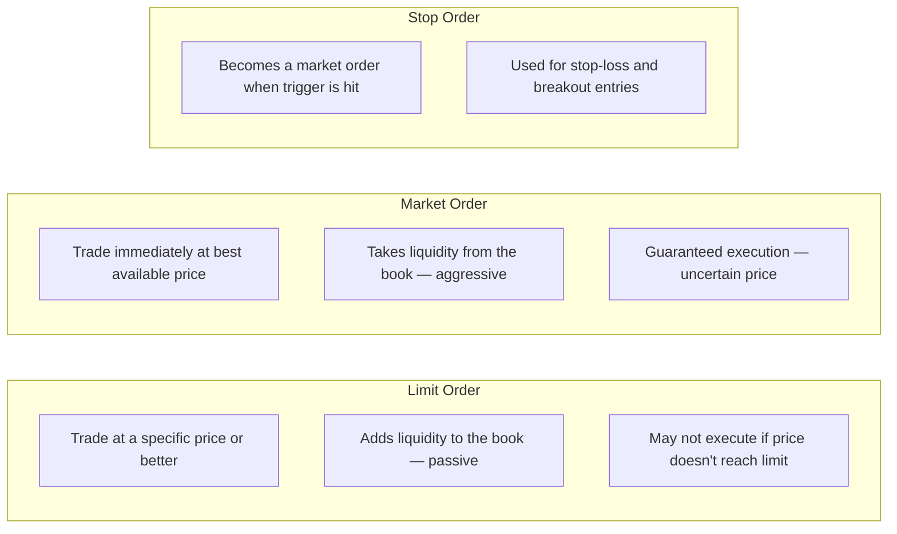

**Market microstructure** studies the mechanics of how markets operate at the trade-by-trade level — how orders interact, how prices are formed, and how information is incorporated. Understanding this is essential for execution quality, short-term price prediction, and recognizing when and how prices move.

---

## The Limit Order Book (LOB)

### Structure of the Book

```
  A limit order book stores all RESTING orders waiting to trade:

  SELL SIDE (Asks/Offers):
  Price    Volume   Orders
  $100.05   200      3
  $100.04   150      2
  $100.03   500      8     ← Best ask (lowest offer)
  ─────────────────────────
  $100.02   800      12    ← Best bid (highest buy)
  $100.01   300      4
  $100.00   250      6
  BUY SIDE (Bids):

  The SPREAD = Best Ask − Best Bid = $100.03 − $100.02 = $0.01 (1 tick)

  MID-PRICE = ($100.03 + $100.02) / 2 = $100.025
```



### Order Book Depth

```
  DEPTH = how much volume is available at each price level

  Shallow book (thin market):
  → Few orders resting; large moves on moderate order flow
  → Higher market impact; higher slippage for large trades
  → Common: illiquid FX crosses, small-cap stocks, early mornings

  Deep book (thick market):
  → Large volume at many price levels
  → Absorbs large orders with less price impact
  → Common: S&P 500 futures (ES), major FX pairs, liquid ETFs

  Book depth is NOT constant:
  → Thins dramatically around news events (uncertainty → quotes pulled)
  → Thins at extremes of ranges (players not willing to fade)
  → Deepens in quiet, range-bound conditions
```

---

## Bid-Ask Spread Decomposition

The spread is not random — it compensates market makers for three distinct costs:

**BID-ASK SPREAD = Order Processing Cost + Inventory Cost + Adverse Selection Cost**

```mermaid
flowchart TD
    S[Bid-Ask Spread] --> C1[1. Order Processing Cost]
    S --> C2[2. Inventory Cost]
    S --> C3[3. Adverse Selection Cost]

    C1 --> R1[Administrative cost of making markets<br/>Fixed: technology, regulatory, back office<br/>Declining over time via electronic markets]
    C2 --> R2[Market makers accumulate unwanted positions<br/>Holding inventory creates directional risk<br/>Glosten-Milgrom 1985: spread widens with uncertainty]
    C3 --> R3[Informed traders know price should move<br/>Market makers lose trading against them<br/>Spread must recoup losses from informed flow<br/>Easley-O'Hara: spread = f(PIN)]
```

---

## The Maker-Taker Model

Modern electronic exchanges use a **maker-taker fee structure** that incentivizes passive liquidity provision:

```
  MAKER: adds a limit order that rests in the book
  → Provides liquidity to the market
  → Receives a REBATE from the exchange (typically -$0.001 to -$0.003/share)
  → "Negative fee" = maker is paid to provide liquidity

  TAKER: sends a market or marketable limit order
  → Removes liquidity from the book
  → Pays a FEE to the exchange (typically $0.002 to $0.003/share)

  Who are makers?
  → High-frequency market makers (Virtu, Citadel Securities)
  → Options market makers (SIG, Jane Street, DRW)
  → Professional dealers

  Who are takers?
  → Institutional investors (executing large orders)
  → Retail flow (often wholesaled off-exchange via PFOF in US)
  → Trend-following algorithms

  Maker-taker distortions:
  → Exchanges compete by increasing maker rebates
  → "Rebate-driven routing": broker routes to exchange paying highest rebate
  → Conflicts of interest: PFOF (Payment for Order Flow) debate
  → SEC Rule 605/606 disclosure requirements (US)
```

---

## Iceberg Orders and Hidden Liquidity

```
  ICEBERG ORDER:
  Shows a small VISIBLE quantity but hides a larger RESERVE quantity

  Example:
  Visible bid: 100 @ $50.00
  Hidden reserve: 2,000 @ $50.00  (not shown)
  → When 100 are taken, next 100 automatically reload
  → Total execution: 2,100 shares at $50.00 without signaling intent

  Why use icebergs?
  → Avoid signaling large order to market
  → "Market impact" of showing 2,000 would move price against you
  → Larger participants (funds, banks) routinely use icebergs

  Detection methods:
  → Same level keeps reloading after each fill
  → Abnormally fast refresh rate at a price level
  → Large imbalance between traded volume and visible depth
  → Algorithmic detection: VWAP anomalies at specific levels

  Dark pools (related concept):
  → Off-exchange trading venues where orders are completely hidden
  → Match buys and sells at or between bid-ask
  → No pre-trade transparency (dark)
  → Advantages: zero market impact; disadvantages: no price discovery
  → ~35-40% of US equity trading in dark pools
```

---

## Order Flow Imbalance (OFI)

**Order flow imbalance** measures the net directional pressure in the order book — a short-term predictor of price movement:

$$\text{OFI} = \text{Buy-initiated volume} - \text{Sell-initiated volume}$$

```
  Measured over a window (e.g., 1 minute, 5 minutes):
  OFI > 0: Net buying pressure → price should rise
  OFI < 0: Net selling pressure → price should fall

  Chopard, Lehalle, et al. (2018):
  OFI is a significant predictor of:
  → Short-term price direction (seconds to minutes)
  → Price impact magnitude
  → Spread widening

  More sophisticated: LOB-based OFI
  → Changes in bid volume + filled trades at ask = imbalance measure
  → Cont, Kukanov, Stoikov (2014): LOB-based OFI predicts 15-min returns

  PRACTICAL APPLICATION:
  → If a large buy imbalance exists but price isn't rising:
    "Hidden sellers absorbing" → potential reversal signal
  → If sell imbalance is met with no price move:
    "Responsive buyers at value" → AMT responsive behavior
  → Large OFI + large price move = INITIATIVE (trend confirmation)
```

### The Kyle Lambda (Price Impact)

Kyle (1985) model: price impact is PERMANENT when informed.

$$\Delta P = \lambda \times \text{OFI}$$

```
  λ (Kyle's Lambda) = price impact per unit of order flow
  → Low λ: liquid market; large volume needed to move price
  → High λ: illiquid market; even small OFI moves price significantly

  Market impact estimation:
  → Almgren-Chriss (2000): optimal execution minimizes market impact
  → Temporary impact: market bounces back (noise from uninformed)
  → Permanent impact: price stays at new level (informed trade)

  For execution algorithms:
  → TWAP (Time-Weighted Average Price): spreads execution over time
  → VWAP (Volume-Weighted Average Price): concentrates in high-volume periods
  → IS (Implementation Shortfall): optimize against benchmark

```
  Rule of thumb (equity markets):
  → σ = daily volatility, Q = order size, V = daily volume
  → Example: σ=1%, Q=1% of ADV → impact ≈ ~0.1%
```

$$\text{Market impact} \approx \sigma \times \sqrt{\frac{Q}{V}}$$

---

## High-Frequency Market Making

```
  HFT market makers operate on microsecond timescales:

  Basic strategy:
  1. Post bid and ask around fair value (earn the spread)
  2. Update quotes in microseconds as new information arrives
  3. Maintain near-zero net inventory (delta-neutral throughout day)
  4. Collect rebates from exchange; gross P&L = spread + rebates

  Revenue model:
  → Earn $0.001–0.003/share × billions of shares × 250 days
  → Virtu Financial (public company): profitable 1,238 of 1,278 trading days
    (2009–2014 period) — near-perfect profitability from market making

  Risk:
  → Adverse selection: informed traders pick off stale quotes
  → "Being run over": market moves rapidly; stale bid gets hit by
    an informed seller just before HFT can update
  → Mitigation: cancel/replace quotes faster than adverse flow

  Market structure impact:
  → Bid-ask spreads dramatically tightened since HFT arrival
  → SPX spread: 25bps (2000) → 1-2bps (2010+)
  → BUT: liquidity is "phantom" — books thin dramatically in stress
  → 2010 Flash Crash: HFTs pulled quotes → liquidity vacuum → −9% in minutes
```

---

## Footprint Charts (Order Flow Visualization)

```
  FOOTPRINT CHART = market profile + order flow:
  Shows the actual buy/sell volume AT EACH PRICE LEVEL within a candle

  For each price level, shows:
  [BUY volume] × [SELL volume]

  Example (one candle, price range $100.00–$100.10):
  $100.10  |  45 × 12  |  ← Mostly buyers; ask being hit
  $100.09  |  38 × 28  |
  $100.08  |  210 × 15 |  ← VOLUME CLUSTER at $100.08 (HVN forming?)
  $100.07  |  42 × 41  |
  $100.06  |  18 × 89  |  ← Mostly sellers; bid being hit
  $100.05  |  11 × 75  |

  Interpretation:
  → $100.08: large buy volume → buyers defended this level aggressively
  → $100.06–07: sellers rejected the move higher
  → "Delta" = total buy − total sell for the candle
  → Negative delta + rising price: "absorption" → potential reversal

  IMBALANCE DETECTION:
  → Cell imbalance: if buy volume > 3× sell volume at same price
    → Strong directional pressure at that level (highlighted)
  → Used to identify where large participants are active
```

---

## Further Reading

- Kyle, A.S. (1985). *Continuous Auctions and Insider Trading.* Econometrica.
- Glosten, L. & Milgrom, P. (1985). *Bid, Ask and Transaction Prices in a Specialist Market.* Journal of Financial Economics.
- Cont, R., Kukanov, A. & Stoikov, S. (2014). *The Price Impact of Order Book Events.* Journal of Financial Econometrics.
- Almgren, R. & Chriss, N. (2000). *Optimal Execution of Portfolio Transactions.* Journal of Risk.
- *Flash Boys* — Michael Lewis (W.W. Norton, 2014) — accessible narrative on HFT market structure
- *Trading and Exchanges* — Larry Harris (Oxford University Press, 2002) — comprehensive microstructure text
