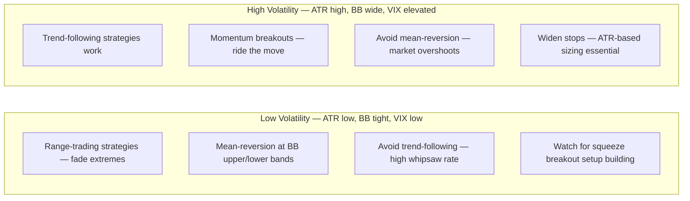

**Volatility indicators** measure how much price is moving — not direction, but the amplitude of moves. They are essential for **setting stops, sizing positions, identifying breakout conditions, and recognising when a market is about to make a significant move**.

---

## 1. Bollinger Bands

Developed by John Bollinger (1983). Three bands plotted around a central moving average — the upper and lower bands expand and contract based on **price volatility (standard deviation)**.

### Formula

$$\text{Middle Band} = \text{SMA}(20)$$

$$\text{Upper Band} = \text{SMA}(20) + 2\sigma_{20}$$

$$\text{Lower Band} = \text{SMA}(20) - 2\sigma_{20}$$

```
  Default: 20-period SMA, 2 standard deviations

  Key property:
  → At 2 standard deviations, approximately 95% of price action
    should fall WITHIN the bands (under normal distribution)
  → When price is at the upper band, it is statistically extended
  → When price is at the lower band, it is statistically depressed
```

### Bollinger Band Visualisation

```
  Price
    │──── Upper Band (2 SD above MA)  ─────────────╮ band widens
    │    /╲      /╲                                 │ (volatility expands)
    │───/──╲────/──╲──── Middle Band (SMA 20) ──────┤
    │  /    ╲  /    ╲                               │
    │────────╲/──────────── Lower Band (2 SD below) ╯ band narrows
    │              ← SQUEEZE
    └──────────────────────────────────── Time
```

### Key Signals

**1. The Squeeze (Volatility Contraction)**
```
  When upper and lower bands converge (narrow):
  → Volatility has compressed to historically low levels
  → Market is coiling before a significant move
  → Direction of breakout = next major trend

  Squeeze identification:
  → Bands are visually narrow
  → Bandwidth indicator at multi-month low
  → Often precedes the biggest moves (e.g., range breakouts)

  Strategy: Wait for band expansion + candlestick confirmation
            to determine direction, THEN enter.
```

**2. Walking the Band (Trend Following)**
```
  Strong uptrend:
  → Price "walks" along the upper band for extended periods
  → Closing repeatedly above/at upper band = sustained momentum
  → NOT an automatic sell signal despite "overbought" appearance

  Strong downtrend:
  → Price walks along the lower band
  → Closing repeatedly at/below lower band = sustained selling

  Misuse: Shorting simply because price is at upper band
  in a strong uptrend is a classic mistake.
```

**3. Mean Reversion Signals**
```
  In ranging / low-trend markets:
  → Price touches upper band + bearish candle = potential short
  → Price touches lower band + bullish candle = potential long
  → Target: Middle band (SMA 20) as mean reversion target

  Conditions required:
  → Market must be range-bound (not trending)
  → Confirm with momentum indicator (RSI near OB/OS)
  → Volume should be declining during the band touch
```

**4. Bollinger Band Bounce at Middle Band (Trend Continuation)**
```
  In uptrend:
  Price pulls back to middle band (SMA 20)
  → Middle band holds as support
  → Price bounces back toward upper band
  → BUY with stop below middle band

  This is a high-probability, well-defined risk trade in trending markets.
```

---

## 2. ATR — Average True Range

Developed by J. Welles Wilder (1978). ATR measures the **average size of price moves** — pure volatility, no direction.

### Formula

$$TR = \max\bigl(\text{High} - \text{Low},\ |\text{High} - \text{Prev Close}|,\ |\text{Low} - \text{Prev Close}|\bigr)$$

$$\text{ATR}(N) = \frac{\text{ATR}_{\text{prev}} \times (N-1) + TR}{N}$$

```
  Default: ATR(14)

  Example (EUR/USD daily):
  Day ranges: 80, 75, 90, 65, 85, 100, 70, 80, 75, 90, 80, 85, 95, 70 pips
  ATR(14) ≈ 81 pips

  Interpretation: EUR/USD moves about 81 pips on an average day
```

### ATR Applications

**1. Stop Loss Placement (ATR Multiple)**
```
  The most important use of ATR:
  Stop = Entry ± (1.5 × ATR) or (2 × ATR)

  Why ATR-based stops:
  → Adapts to current market volatility
  → Low volatility = tighter stop (market moves less)
  → High volatility = wider stop (market moves more)
  → Prevents getting stopped out by normal noise

  Example:
  EUR/USD long entry at 1.0850
  ATR(14 daily) = 0.0080 (80 pips)
  Stop at 1.5× ATR: 1.0850 − 0.0120 = 1.0730

  In a high-vol period (ATR 140 pips):
  Stop at 1.5× ATR: 1.0850 − 0.0210 = 1.0640
  → Wider stop acknowledges higher daily range
```

**2. Position Sizing (Volatility-Adjusted)**
```
  Position size formula:
  Size = Account Risk ($) / ATR

  Example:
  Account: $100,000
  Risk per trade: 1% = $1,000
  EUR/USD ATR: 80 pips = $800 per lot (standard lot)

  Size = $1,000 / $800 = 1.25 lots

  → Ensures every trade risks the same dollar amount
    regardless of the volatility of the instrument
```

**3. Volatility Regime Identification**
```
  ATR rising:  Volatility expanding → trend developing or event risk
  ATR falling: Volatility contracting → consolidation, squeeze likely

  Compare ATR to its own moving average:
  ATR > ATR_MA(20): Above-average volatility (trending)
  ATR < ATR_MA(20): Below-average volatility (quiet, watch for squeeze)
```

**4. Profit Target Setting**
```
  Target = Entry ± (2–3 × ATR)
  Gives realistic targets based on typical range
  Avoids setting targets that the market rarely reaches in one move
```

---

## 3. Keltner Channels

Similar to Bollinger Bands but uses **ATR** instead of standard deviation for the channel width:

$$\text{Middle Line} = \text{EMA}(20)$$

$$\text{Upper Channel} = \text{EMA}(20) + 2 \times \text{ATR}(10)$$

$$\text{Lower Channel} = \text{EMA}(20) - 2 \times \text{ATR}(10)$$

Key difference from Bollinger Bands:
- Bollinger Bands are based on standard deviation (price dispersion)
- Keltner Channels are based on ATR (range-based volatility)
- Keltner Channels tend to be smoother — less responsive to spike moves

### Bollinger Bands vs. Keltner Channels

```
  "Squeeze" signal (very popular):
  When Bollinger Bands are INSIDE Keltner Channels:
  → Rare extreme compression of volatility
  → Predicts large imminent move
  → Used by traders to pre-position before breakout

  ┌────────────────────────────────────────────────────────┐
  │  Keltner upper  ─────────────────────────────────────  │
  │  BB upper       ───────────────── (BB inside KC)        │
  │  EMA(20)        ──────────── ← centre                  │
  │  BB lower       ───────────────── (BB inside KC)        │
  │  Keltner lower  ─────────────────────────────────────  │
  │                         ↑ SQUEEZE = extreme compression │
  └────────────────────────────────────────────────────────┘
```

---

## 4. Donchian Channels

Shows the **highest high and lowest low** over N periods — used in classic trend-following systems:

```
  Upper Channel = Highest High over N periods
  Lower Channel = Lowest Low over N periods
  Middle Line   = (Upper + Lower) / 2

  Default: N = 20

  Trading system (Turtle Trading, Donchian breakout):
  → BUY if price breaks above 20-day high
  → SELL if price breaks below 20-day low
  → Exit: when price breaches 10-day high/low in opposite direction

  This is one of the oldest and most studied trend-following systems.
  Richard Dennis and William Eckhardt proved it worked in the 1980s
  Turtle Trading experiment — training 23 novices who made $100M+ in 4 years.
```

---

## Volatility Regimes and Strategy Selection

The choice of strategy should match the **volatility regime**:



---

## Bandwidth Indicator

A derived indicator from Bollinger Bands showing **how wide the bands are relative to the middle band**:

$$\text{Bandwidth} = \frac{\text{Upper Band} - \text{Lower Band}}{\text{Middle Band}} \times 100$$

```
  Low reading:  Bands tight → squeeze → watch for breakout
  High reading: Bands wide → volatility already elevated
```

---

## Practical Volatility Checklist

```
  Before any trade, check:
  ─────────────────────────────────────────────────────────
  □ What is the current ATR? (set stop accordingly)
  □ Are Bollinger Bands squeezing or expanding?
  □ Is ATR above or below its 20-period average?
  □ Is the VIX elevated? (affects all assets)
  □ Is there an imminent event risk? (NFP, FOMC, etc.)
    → If yes: vol will spike at announcement → widen stops
    → Or: reduce position size ahead of event
  ─────────────────────────────────────────────────────────
```

---

## Further Reading

- ChartingLens: *RSI, MACD & Bollinger Bands Guide* — [chartinglens.com](https://chartinglens.com/blog/rsi-macd-bollinger-bands-guide)
- LuxAlgo: *Bollinger Bands and MACD Entry Rules* — [luxalgo.com](https://www.luxalgo.com/blog/bollinger-bands-and-macd-entry-rules-explained/)
- Bollinger, J. (2001). *Bollinger on Bollinger Bands*. McGraw-Hill.
- Wilder, J.W. (1978). *New Concepts in Technical Trading Systems*. Trend Research.
